# Distributed Video Processing Pipeline

Two microservices that extract frames from a video at a requested rate and run
face detection on them.

- **VideoAnalyzer** — `POST /analyze`, decodes the video, samples frames at 2 or
  4 fps, and dispatches each one for detection.
- **StreamDetector** — consumes frames, runs the detector, batches the results
  and hands them to `send_results_next_service`.

They share no filesystem and can run on different machines. RabbitMQ carries the
work; Redis carries the frame bytes and the job state.

```mermaid
---
config:
  theme: mc
---
flowchart LR
    C[Client] -->|"1. POST /analyze"| VA

    subgraph VA[VideoAnalyzer :8000]
        API["2. FastAPI + validation"] --> SVC["3. AnalysisService"]
        SVC --> DEC["4. decode thread<br/>grab/retrieve + JPEG"]
        DEC -->|"5. bounded asyncio.Queue<br/>BACKPRESSURE"| PUB["6. K publisher tasks"]
    end

    PUB -->|"7. SET blob, TTL"| R[("Redis<br/>frame blobs + job state")]
    PUB -->|"8. publish ~200B ref<br/>partition = sha256(video_id)<br/>await PUBLISHER CONFIRM"| MQ[["RabbitMQ<br/>frames.work.0 .. .N<br/>one ACTIVE consumer each"]]
    PUB -->|"9. 200 OK — only after ALL confirms"| C

    MQ -->|"10. in order per video<br/>prefetch, manual ack"| SD1["StreamDetector #1<br/>active on some partitions"]
    MQ --> SD2["StreamDetector #2<br/>active on the others"]
    MQ -.->|"standby — promoted if an active consumer dies"| SDN["StreamDetector #N"]

    R -.->|"11. GET blob"| SD1
    SD1 --> DET["12. detect_faces"] --> BATCH["13. ResultBatcher<br/>size OR time flush"]
    BATCH --> NEXT["14. send_results_next_service"]
    BATCH -.->|"15. CONSUMER ACK (detector to broker)<br/>batch's delivery tags, after flush"| MQ
    MQ -.->|"16. nack, no requeue"| DLQ[["frames.dlq<br/>bounded 10k / 24h"]]
```



Steps 1–9 happen inside the blocking HTTP request; 10–16 run afterwards.
Full rationale in [`design/stage 1/`](design/stage%201/).

---

## Reviewer's guide

**See it work — two commands:**

```bash
docker compose up --build     # wait for 5 healthy containers

curl -s -X POST http://localhost:8000/analyze   -H 'Content-Type: application/json'   -d '{"file_path":"G20_Summit.mp4","fps":2}'
```

*(`curl` ships with macOS, Linux and Windows 11 alike. On Windows PowerShell,
`Invoke-RestMethod -Uri … -Method Post -ContentType application/json -Body '…'`
does the same thing.)*

The number to look at is **`frames_dispatched: 279`**. A naive
`stride = int(25/2) = 12` produces 291 and drifts against wall time — the shipped
video is 25 fps, so neither 25/2 nor 25/4 is a whole number. That is the single
most important thing in this submission; the reasoning is
[below](#the-25-fps-trap).

**If you read only three files:**

| File | Why |
|---|---|
| [`video_analyzer/domain/frame_sampler.py`](video_analyzer/domain/frame_sampler.py) | The correctness core. Pure, no I/O — which is why the sampling is provable rather than plausible. |
| [`video_analyzer/services/frame_pipeline.py`](video_analyzer/services/frame_pipeline.py) | The concurrency model: decode thread → bounded queue → publisher pool. The queue bound *is* the backpressure. |
| [`stream_detector/batching.py`](stream_detector/batching.py) | Why the ack comes *after* the flush, and why the buffer needs a lock. |

**Run the tests without installing anything else** — 228 of them, no Docker, no
broker required. That the integration suite passes with nothing running is the
evidence the ports/adapters split is real rather than decorative.

**Deliberately beyond the brief** (~8% of the code), so none of it reads as
accidental scope creep:

| Addition | Why it's here |
|---|---|
| Checkpoint resume | Stage 2 asks about fault tolerance; this is that answer, running rather than described |
| `stream_detector/healthcheck.py` | A queue consumer has no HTTP endpoint for compose to probe |
| `EXTRA_CA_BUNDLE` build arg | No-op by default. Insurance so a corporate TLS-inspecting proxy can't make the build fail for you |

Everything else maps to an explicit requirement — the traceability table is
[at the end](#requirements-traceability).

---

## Prerequisites

**One thing: [Docker Desktop for Windows](https://docs.docker.com/desktop/install/windows-install/)**
(WSL2 backend). It bundles Compose v2 and brings RabbitMQ and Redis up as
containers — you do **not** install those separately.

**Runs the same on macOS, Linux and Windows.** Both services run in Linux
containers, so the host OS never matters; every image (`python:3.12-slim`,
`rabbitmq`, `redis`) is multi-arch, so Apple Silicon builds natively as arm64
with no `platform:` override. Commands below use `curl`, which ships with all
three.

- **macOS / Linux:** install Docker Desktop (or Colima / Docker Engine). Nothing else.
- **Windows:** Docker Desktop with the WSL2 backend. Check WSL with
  `wsl --version`; if missing, run `wsl --install` from an admin PowerShell and reboot.
- Verify: `docker --version && docker compose version`

**Optional**, only to run the tests outside containers (Python 3.12+):

```bash
# macOS / Linux
python3.12 -m venv .venv && source .venv/bin/activate
pip install -r requirements-dev.txt
```

```powershell
# Windows PowerShell
py -3.12 -m venv .venv; .\.venv\Scripts\Activate.ps1
pip install -r requirements-dev.txt
```

> **The video is not in this repository.** `G20_Summit.mp4` is 129 MB, over
> GitHub's 100 MB per-file limit, so `videos/` is gitignored. Drop any video
> into `videos/` and pass its filename to `/analyze`.

### ⚠️ Troubleshooting: `pip install` fails with `CERTIFICATE_VERIFY_FAILED`

```
SSLCertVerificationError: unable to get local issuer certificate
```

**Cause:** an antivirus with HTTPS scanning — AVG, Avast, ESET and Kaspersky all
do this — is intercepting the connection and re-signing it with its own private
root CA. Windows trusts that CA, which is why your browser works, but Python
ships its own `certifi` bundle and never consults the Windows store.

You can confirm it in one command; if the issuer is not a public CA, that is the
interceptor:

```powershell
$t = New-Object Net.Sockets.TcpClient("pypi.org", 443)
$s = New-Object Net.Security.SslStream($t.GetStream(), $false, {$true})
$s.AuthenticateAsClient("pypi.org")
(New-Object Security.Cryptography.X509Certificates.X509Certificate2($s.RemoteCertificate)).Issuer
# e.g. CN=AVG Web/Mail Shield Root, OU=generated by AVG Antivirus for SSL/TLS scanning
```

**Fix** — give Python the certificates Windows already trusts, rather than
disabling verification:

```powershell
$lines = foreach ($c in (Get-ChildItem Cert:\LocalMachine\Root)) {
  "-----BEGIN CERTIFICATE-----"
  [Convert]::ToBase64String($c.RawData, 'InsertLineBreaks')
  "-----END CERTIFICATE-----"
}
New-Item -ItemType Directory -Force "$HOME\.certs" | Out-Null
Set-Content "$HOME\.certs\windows-roots.pem" $lines -Encoding ascii
pip config set global.cert "$HOME\.certs\windows-roots.pem"
```

**Docker builds are normally unaffected** — container traffic goes through WSL2
and bypasses the host interceptor (verified here). If yours *is* affected, the
Dockerfiles accept an optional CA bundle: see [`docker/ca/README.md`](docker/ca/README.md).

---

## Quick start

```powershell
docker compose up --build
```

Wait for all five containers to report healthy, then:

```bash
curl -s -X POST http://localhost:8000/analyze   -H 'Content-Type: application/json'   -d '{"file_path":"G20_Summit.mp4","fps":2}'
```

```json
{
  "job_id": "47944c8bb90d457abbd715d06d6c15c7",
  "video_id": "g20-summit-af924b63",
  "status": "COMPLETED",
  "source_fps": 25.0,
  "target_fps": 2,
  "total_source_frames": 3488,
  "frames_expected": 279,
  "frames_dispatched": 279,
  "frames_failed": 0,
  "video_duration_sec": 139.52,
  "elapsed_sec": 2.217,
  "realtime_factor": 62.92,
  "resumed_after_frame": null,
  "frames_dispatched_this_run": 279
}
```

**139.5 seconds of video processed in 2.2 seconds — 62.9× faster than real
time** (measured on 28 cores / 15.5 GB, 2 detector replicas). Detection
continues after the response; poll for it:

```bash
curl -s http://localhost:8000/jobs/47944c8bb90d457abbd715d06d6c15c7
# ... "frames_dispatched": 279, "frames_processed": 279
```

Interactive API docs: <http://localhost:8000/docs>.
RabbitMQ console: <http://localhost:15672> (`guest`/`guest`).

---

## What actually happens to one frame

| # | Step | Where |
|---|---|---|
| 1 | `POST /analyze` | `video_analyzer/api/routes.py` |
| 2 | Validate: schema, `fps ∈ {2,4}`, path contained in `VIDEO_ROOT` | `api/schemas.py`, `domain/paths.py` |
| 3 | Probe the video, create the job record | `services/analysis_service.py` |
| 4 | `grab()` every frame; `retrieve()` + JPEG only for kept frames | `domain/video_source.py` |
| 5 | Bounded queue — a full queue **blocks the decoder** | `services/analysis_service.py` |
| 6 | Fixed pool of publisher tasks | `services/analysis_service.py` |
| 7 | `SET` the ~80 KB JPEG in Redis with a TTL | `pipeline_common/adapters/redis_store.py` |
| 8 | Publish a ~200 byte reference, **await the publisher confirm** | `pipeline_common/adapters/rabbitmq.py` |
| 9 | **200 OK**, once every frame is confirmed durable | `api/routes.py` |
| 10 | Detectors compete for messages, bounded by `prefetch` | `stream_detector/consumer.py` |
| 11 | `GET` the blob, `imdecode` back to an ndarray | `stream_detector/processing.py` |
| 12 | `detect_faces()` — the provided mock, unmodified | `stream_detector/detector.py` |
| 13 | Buffer; flush on 32 results **or** 500 ms **or** shutdown | `stream_detector/batching.py` |
| 14 | `send_results_next_service(List[RespObject])` | `detector_response_handling.py` |
| 15 | **Ack the batch — only after the flush succeeded** | `stream_detector/batching.py` |
| 16 | Unusable frames dead-letter to `frames.dlq` | `stream_detector/consumer.py` |

---

## Design highlights

### The 25 fps trap

The brief's example is 30 fps → 2 fps → "every 15th frame", a clean integer. The
video shipped with the assignment is **25 fps**, where `25/2 = 12.5` and
`25/4 = 6.25` — **neither ratio is an integer**.

`stride = int(source_fps / target_fps)` gives 12, which emits **291 frames
instead of 279** (and 582 instead of 558 at 4 fps). That 4% overshoot
accumulates as clock drift, so every frame's timestamp is progressively wrong.

So sampling is timestamp-based, computed fresh per output slot from exact
rational arithmetic — never accumulated, which would drift in float64:

```
i_k = floor(k * source_fps / target_fps + 1/2)
```

| source | target | frames | gaps | note |
|---|---|---|---|---|
| 25 | 2 | **279** | 12, 13 | mean exactly 12.5 |
| 25 | 4 | **558** | 6, 7 | mean exactly 6.25 |
| 30 | 2 | 233 | **15 only** | reproduces the brief's example exactly |
| 29.97 | 4 | — | 7, 8 | NTSC handled exactly |

The third row matters: this is a strict superset of the specified behaviour.
See [`video_analyzer/domain/frame_sampler.py`](video_analyzer/domain/frame_sampler.py).

### "200 OK only after dispatching" is a real guarantee

Publisher confirms are enabled, so `/analyze` returns 200 only once RabbitMQ has
**durably accepted every frame**. If any confirm fails you get **502**, never a
200 that quietly lost frames.

It deliberately does *not* wait for detection — that would undo the decoupling.
You can watch this directly: stop every detector, POST `/analyze`, and you still
get 200 with all 558 frames sitting in the queue.

### The two "acks" are unrelated

AMQP uses the same `basic.ack` frame for both, in opposite directions:

| | Publisher confirm (step 8) | Consumer ack (step 15) |
|---|---|---|
| Direction | RabbitMQ **→** analyzer | detector **→** RabbitMQ |
| Means | "durably stored" | "processed, you may delete it" |
| If absent | 502 instead of 200 | broker redelivers to another consumer |
| Buys | a **truthful 200** | **crash tolerance** |

### Claim-check

A 720p frame is ~2.76 MB raw, ~80 KB as JPEG. The JPEG goes to Redis under a
TTL'd key; only a ~200 byte reference rides the queue. Broker stays fast,
backlog memory is bounded by the TTL rather than the queue, and the two services
need no shared filesystem.

### Batch-level ack

`send_results_next_service` takes a `List`, so results are batched. The subtlety
is *when* to ack: acking on receipt would let the broker delete frames whose
results are still in an unflushed buffer, and a crash there loses them silently.
Acking only after a successful flush turns that same crash into a redelivery.

### Results are ordered per video

The downstream service requires frames in order per video, so `video_id` is
hashed to one of `FRAME_PARTITIONS` queues, each declared
`x-single-active-consumer`. RabbitMQ then activates exactly one consumer per
partition, so a video's frames cannot overtake one another — while different
videos sit on different partitions and still run in parallel.

```
video A ──sha256──▶ frames.work.2 ──▶ [active]   ← one consumer, in order
video B ──sha256──▶ frames.work.0 ──▶ [active]   ← different video, parallel
                                  └──▶ [standby] ← promoted automatically
```

`sha256`, not `hash()`: Python salts `hash()` per process, so the analyzer and
detector would disagree about a video's partition — surfacing only as
intermittent out-of-order results in production.

Parallelism is now bounded by partition count rather than consumer count, so
raise the two together. Failover comes free: when an active consumer dies the
broker promotes a standby, with no leader election of our own.

---

## Failure handling

| Failure | What happens |
|---|---|
| Detector crashes mid-frame | Unacked → RabbitMQ redelivers to another replica |
| Detector crashes holding a partial batch | Never acked → redelivered. This is *why* acks come after the flush |
| Analyzer crashes mid-job | Progress is checkpointed every 50 **confirmed** frames; re-submitting the same request **resumes from the checkpoint** rather than redoing the video |
| Frame blob expired or corrupt | Dead-lettered immediately — retrying identical bytes cannot help |
| Redis briefly unreachable | Requeued once; a second failure dead-letters rather than looping |
| Broker or store down at request time | **503** with `Retry-After`, before any decoding work is wasted |
| Duplicate delivery | `SET NX` dedup guard; the frame is acked but not re-reported |
| Client disconnects mid-request | Decoding aborts, job marked `CANCELLED` |
| A few undecodable frames | Skipped and counted; the job fails only above a 5% failure ratio |

### Checkpoint resume

A crashed job is not restarted from zero. `resume_key = sha256(video_id | fps)`
points at the job record; re-submitting the *same* request continues it, using
`slot_after_source_index()` to turn `last_source_index` into the next output slot
and one seek to skip the confirmed prefix. The `job_id` is continued, so
`frames_dispatched` stays cumulative across attempts.

The seek is verified rather than trusted: landing early is harmless (extra frames
are grabbed and skipped), landing late falls back to a full rescan — slower, never
wrong.

A `RUNNING` record is ambiguous — crashed, or still working on another replica —
so resume waits out `STALE_RUNNING_JOB_SEC` (120 s) of checkpoint silence. That
window is a **safety property**: resuming a genuinely live job would double-dispatch
every remaining frame. A proper lease would shrink it to seconds.

**Verified on the running stack:**

```bash
# Kill a detector mid-drain -- nothing is lost
docker kill corsight-video-pipeline-stream_detector-3
# -> queue drains to 0, DLQ 0, frames_processed reaches 558/558

# Force the dead-letter path by deleting blobs
docker compose exec redis redis-cli DEL "frame:<job_id>:0"
# -> exactly those frames land in frames.dlq; the rest keep flowing

# Kill the ANALYZER mid-job, then re-POST the same request
docker kill corsight-video-pipeline-video_analyzer-1
```

```json
{ "job_id": "98a3efca…",            // same job, continued
  "resumed_after_frame": 1244,
  "frames_dispatched_this_run": 358, // 200 already done + 358 = 558
  "frames_dispatched": 558,
  "status": "COMPLETED" }
```

No gap at the seam, no frame dispatched twice.

### The dead-letter queue is bounded

It holds ~200 byte references, not frame bytes, so a handful of dead frames costs
about a kilobyte — cheap, and the only evidence you get that something went wrong
(a missing blob usually means the backlog outlived the TTL, i.e. detectors are
under-scaled). The hazard is not five messages but a **stampede**, so the queue is
capped: `x-max-length 10000`, `x-message-ttl 24h`, `x-overflow drop-head` — during
an incident the newest failures describe what is happening now.

---

## Scaling

```bash
docker compose up -d --scale stream_detector=4
docker compose exec rabbitmq rabbitmqctl list_queues name messages consumers
```

```
frames.work   0   4
frames.dlq    0   0
```

Four competing consumers share one queue. Each message goes to exactly one of
them, so throughput scales roughly linearly — no code change, no coordination.

A single RabbitMQ classic queue is one Erlang process and tops out around
30–50k msg/s; this workload is ~4 msg/s, four orders of magnitude below it. The
bottleneck at this scale is decode CPU in the analyzer, not the queue.

---

## Running the tests

**228 tests, and they need no Docker, no Redis and no RabbitMQ:**

```bash
pytest -q          # or .\.venv\Scripts\python.exe -m pytest -q on Windows
```

| Suite | Tests | What it covers |
|---|---:|---|
| `tests/unit` | 123 | Sampling maths, resume slot inverse, path containment, batcher flush/ack/race |
| `tests/integration` | 71 | Full `/analyze` flow, detector pipeline, and checkpoint resume |
| `tests/contract` | 34 | One suite against **both** the doubles and the real adapters, incl. per-video ordering |

That the integration suite passes with nothing running is the proof the
ports/adapters split is real rather than decorative.

**Contract tests** are the guard against the classic failure where a suite is
green only because the double is more forgiving than production. The same
assertions run against both:

```bash
docker compose up -d redis rabbitmq
pytest tests/contract -q     # 34 passed
```

Offline, the real-adapter parameters skip (17 pass / 17 skip) and the suite
stays green. With infrastructure up, both run — and any divergence fails.

```bash
ruff check .     # All checks passed
mypy .           # Success: no issues found in 46 source files (incl. tests)
```

---

## API

### `POST /analyze`

```json
{"file_path": "G20_Summit.mp4", "fps": 2}
```

`file_path` is absolute or relative to `VIDEO_ROOT`. `fps` must be exactly 2 or 4.

| Status | Code | When |
|---|---|---|
| 200 | — | Every frame confirmed durable by the broker |
| 400 | `invalid_file_path` | Malformed, or resolves outside `VIDEO_ROOT` |
| 404 | `video_not_found` | No such file |
| 415 | `undecodable_video` | File exists but is not decodable video |
| 422 | `validation_error` | `fps` not 2 or 4, missing/unknown fields |
| 422 | `invalid_frame_rate` | e.g. 4 fps requested from a 3 fps source |
| 409 | `job_already_running` | Same video+fps already being analyzed |
| 429 | `too_many_concurrent_jobs` | All admission slots busy; `Retry-After` set |
| 502 | `dispatch_incomplete` | Broker did not confirm every frame |
| 503 | `infrastructure_unavailable` | Redis or RabbitMQ unreachable |

Errors share one envelope; filesystem paths are never echoed back:

```json
{"error": {"code": "invalid_file_path", "message": "..."}}
```

### `GET /jobs/{job_id}`

Progress including work done by detectors after the 200 — poll until
`frames_processed == frames_dispatched`.

### `GET /health`

`{"status": "ok", "broker": true, "frame_store": true}`

---

## Configuration

All values have working defaults; see [`.env.example`](.env.example).

| Variable | Default | Purpose |
|---|---|---|
| `VIDEO_ROOT` | `/data/videos` | Only paths inside this may be analyzed |
| `JPEG_QUALITY` | `85` | ~80 KB per 720p frame |
| `ANALYZER_QUEUE_SIZE` | `256` | **The backpressure knob** — a full queue blocks decoding |
| `ANALYZER_PUBLISHERS` | `4` | Concurrent publish tasks |
| `FRAME_BLOB_TTL_SEC` | `3600` | Blobs self-expire; a crashed run leaves no garbage |
| `CHECKPOINT_EVERY` | `50` | Confirmed frames between checkpoints |
| `FRAME_PARTITIONS` | `4` | Queues to hash videos across. **Bounds parallel videos**; both services must agree |
| `MAX_CONCURRENT_JOBS` | `4` | Admission slots; 429 beyond |
| `MAX_FRAME_AGE_SEC` | `0` | Shed frames past this age. 0 = never (correct for files); set to the latency budget for a live camera |
| `DETECTOR_PREFETCH` | `32` | Max unacked messages per detector |
| `BATCH_MAX_SIZE` / `BATCH_MAX_LATENCY_MS` | `32` / `500` | Flush on whichever comes first |
| `DEDUP_TTL_SEC` | `3600` | Idempotency window for redelivery |

Redis runs with `--maxmemory-policy noeviction` **deliberately**: under
`allkeys-lru` it would silently evict frame blobs when memory filled, producing
frames that dead-letter for no visible reason. Failing the write loudly is far
easier to diagnose.

---

## Project layout

```
pipeline_common/        # shared by both services
  ports.py              #   Protocols: FrameStore, FramePublisher, JobRepository...
  messages.py           #   FrameRef -- the wire contract
  adapters/             #   redis_store, rabbitmq, memory (test doubles)
video_analyzer/
  domain/               # pure logic: frame_sampler, video_source, paths, identity
  services/
    analysis_service.py #   job lifecycle: fresh vs resumed, final status
    frame_pipeline.py   #   the concurrency: decode thread, queue, publishers
    errors.py           #   the vocabulary api/errors.py maps to status codes
  api/                  # routes, schemas, error mapping
stream_detector/
  detector.py                     # PROVIDED, unmodified
  detector_response_handling.py   # PROVIDED, unmodified
  processing.py · batching.py · consumer.py
tests/                  # unit · integration · contract
design/stage 1/         # design document + diagrams
```

Both services depend only on the Protocols in `pipeline_common/ports.py`; the
concrete adapters are injected at a single composition root in each `main.py`.
Domain code never imports `redis` or `aio_pika` — which is exactly why the tests
run without them.

---

## Known limitations

- **The synchronous 200 is bounded by HTTP timeouts.** 2.2 s for this video is
  fine, but a multi-hour video would exceed typical gateway limits. That is
  inherent to the requirement as written; the fix is an async job + polling or
  webhook pattern.
- **Parallelism is bounded by `FRAME_PARTITIONS`**, not by detector count —
  per-video ordering requires one active consumer per partition, so the two must
  be raised together. A single very hot video cannot be spread across consumers;
  that is inherent to ordering, and a live deployment would partition by camera.
- **At-least-once delivery.** The dedup guard absorbs redelivery, but a
  downstream consumer should still be idempotent.
- **One work queue is one Erlang process.** Ample here; shard by `hash(video_id)`
  when it stops being.
- **Variable-frame-rate video** falls back to `CAP_PROP_POS_MSEC` timestamps.
  Exotic containers may report unreliable metadata; `CAP_PROP_FRAME_COUNT` is
  never trusted as a loop bound for this reason.
- **Resume waits out a 120 s staleness window** before continuing a `RUNNING`
  job, since a live job must never be resumed concurrently. A Redis lease would
  cut this to seconds.
- **Job history lives in Redis**, which is right for hot, TTL-scoped state but
  cannot answer "which videos failed last week". The `JobRepository` port exists
  so adding a Postgres adapter is additive.
