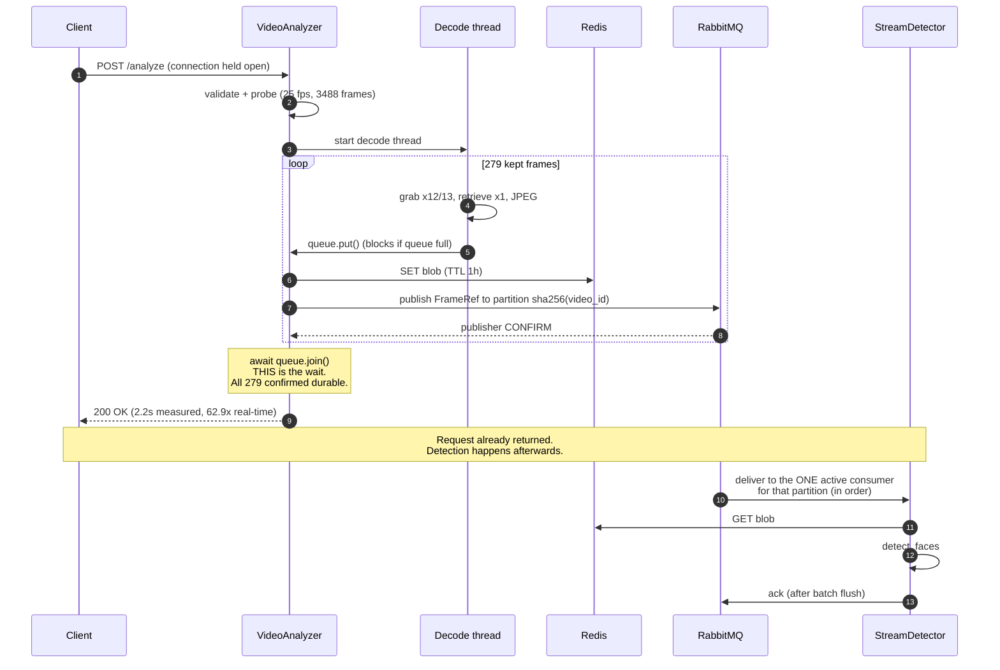

# Distributed Video Processing Pipeline — Design (Stage 1)

## Context

Take-home for a **Backend Tech Lead** role. The functional requirements are modest (extract frames
at 2 or 4 fps, run a mock detector). The real evaluation axis is **judgement**: defensible
mechanisms, named tradeoffs, and a structure a team could extend.

Goal: every requirement in the brief maps to a concrete mechanism we can point at in the interview.

### What we start from

The boilerplate is almost entirely empty. Two files have content and are **fixed contracts — do not modify**:

- `stream_detector/detector.py` — `StreamFaceDetector.detect_faces(frame: np.ndarray) -> List[BoundingBox]`.
  Takes a **decoded numpy array** → detector must decode JPEG back to `ndarray`.
- `stream_detector/detector_response_handling.py` — `send_results_next_service(results: List[RespObject])`.
  Takes a **List** → batching is intended, not optional.
- `RespObject` fields: `faces`, `video_id`, `frame_id`. (PDF prose says "frame_number"; **code wins**.)
- It does `from stream_detector.detector import BoundingBox` → `stream_detector` must stay an
  importable package root. This constrains the layout (§7).

Empty, we author: both `main.py`, both `Dockerfile`, both `requirements.txt`, `docker-compose.yml`.

### The detail that decides this assignment

`videos/G20_Summit.mp4` is **1280×720, h264, 25 fps, 3488 frames, 139.52 s**.

The PDF's example is 30fps→2fps→"every 15th frame". The shipped video is **25 fps**, where
`25/2 = 12.5` and `25/4 = 6.25` — **neither is an integer**. The obvious
`stride = int(source_fps / target_fps)` gives stride 12/6 → 291 and 582 frames instead of **279 and
558**: a ~4% overshoot that accumulates as **clock drift**, so every frame's timestamp is
progressively wrong.

Most submissions will use integer stride. Getting this right — and explaining why in the README —
is the cheapest high-signal differentiator available. **Confirm the intended behaviour with the
interviewer (§16 Q1) before implementing.**

### Decisions settled up front

| Decision | Choice |
|---|---|
| Transport | **RabbitMQ** work queue + **Redis** blob store / job state |
| Frame payload | **Claim-check** — JPEG in Redis, ~200 B reference on the queue |
| Scope | **Polished & focused** — no Prometheus/Grafana, no CI (Stage-2 talking points) |

---

## 1. Deliverables

1. `design/stage 1/Distributed Video Processing Pipeline Design - Stage 1.md` — this document,
   alongside rendered `flow diagram/` and `sequence diagram/` exports (`.mmd` + `.png` + `.pdf`).
2. `README.md` — prerequisites, install, run, what it does, how to verify. Outline in §13.
3. Both services, `Dockerfile` each, one `docker-compose.yml`.
4. `pytest` suite green with **zero infrastructure**.

---

## 2. Architecture

### 2.1 Numbered flow

Steps **1–9** happen inside the blocking HTTP request; **10–16** run afterwards, asynchronously.

```mermaid
---
config:
  theme: mc
---
flowchart LR
    C[Client] -->|"1. POST /analyze"| VA

    subgraph VA[VideoAnalyzer :8000]
        API["2. FastAPI + validation"] --> SVC["3. AnalysisService"]
        SVC --> DEC["4. decode thread<br/>grab/retrieve + JPEG"]
        DEC -->|"5. bounded asyncio.Queue<br/>BACKPRESSURE"| PUB["6. K publisher tasks"]
    end

    PUB -->|"7. SET blob, TTL"| R[("Redis<br/>frame blobs + job state")]
    PUB -->|"8. publish ~200B ref<br/>partition = sha256(video_id)<br/>await PUBLISHER CONFIRM"| MQ[["RabbitMQ<br/>frames.work.0 .. .N<br/>one ACTIVE consumer each"]]
    PUB -->|"9. 200 OK — only after ALL confirms"| C

    MQ -->|"10. in order per video<br/>prefetch, manual ack"| SD1["StreamDetector #1<br/>active on some partitions"]
    MQ --> SD2["StreamDetector #2<br/>active on the others"]
    MQ -.->|"standby — promoted if an active consumer dies"| SDN["StreamDetector #N"]

    R -.->|"11. GET blob"| SD1
    SD1 --> DET["12. detect_faces"] --> BATCH["13. ResultBatcher<br/>size OR time flush"]
    BATCH --> NEXT["14. send_results_next_service"]
    BATCH -.->|"15. CONSUMER ACK (detector to broker)<br/>batch's delivery tags, after flush"| MQ
    MQ -.->|"16. nack, no requeue"| DLQ[["frames.dlq<br/>bounded 10k / 24h"]]
```



### 2.2 Step reference

| # | Step | Where |
|---|---|---|
| 1 | `POST /analyze` | `api/routes.py` |
| 2 | Validate: schema, `fps ∈ {2,4}`, path inside `VIDEO_ROOT` (§9) | `api/schemas.py`, `domain/paths.py` |
| 3 | Probe video, create job record `status=RUNNING` | `services/analysis_service.py` |
| 4 | Decode: `grab()` every frame, `retrieve()`+JPEG only for **kept** frames (§4.1, §4.5) | `domain/frame_sampler.py`, `domain/video_source.py` |
| 5 | Bounded queue — **blocks the decode thread when full = backpressure** | `services/analysis_service.py` |
| 6 | Fixed pool of K publishers (no Semaphore needed — §6.1) | `services/analysis_service.py` |
| 7 | `SET` JPEG blob, TTL — claim-check (§4.3); checkpoint every 50 (§5.2) | `adapters/redis_store.py` |
| 8 | Publish ~200 B `FrameRef`, **await publisher confirm** — broker → analyzer (§2.4) | `adapters/rabbitmq.py` |
| 9 | **200 OK — only after every frame is confirmed durable** (§2.3) | `api/routes.py` |
| 10 | Competing consumers, `prefetch=N` (§4.2, §4.7) | `stream_detector/consumer.py` |
| 11 | `GET` blob → `imdecode` → `ndarray` | `stream_detector/processing.py` |
| 12 | `detect_faces()` — provided mock, **unmodified**, in executor | `stream_detector/detector.py` |
| 13 | Buffer + delivery tags; flush on 32 **or** 500 ms **or** shutdown; `asyncio.Lock` (§6.1) | `stream_detector/batching.py` |
| 14 | `send_results_next_service(List[RespObject])` | `detector_response_handling.py` |
| 15 | **Consumer ack** — detector → broker, batch's tags, only after flush (§2.4, §4.6) | `stream_detector/batching.py` |
| 16 | Blob expired / corrupt JPEG → DLQ, no retry loop (§5.3) | `stream_detector/consumer.py` |

### 2.3 Where the 200 OK actually blocks

The brief: *"return 200 OK only after it has finished reading and dispatching all relevant frames."*
**Yes — the HTTP request blocks.** For `G20_Summit.mp4` the client's connection is held open for
**2.2 s (measured)** while **steps 1–9** of §2.1 run. Steps 10–16 happen afterwards, asynchronously.



**The critical distinction:** *dispatched* = **RabbitMQ has confirmed the frame is durably
enqueued**. It does **not** mean a detector has processed it.

- **We wait for:** every frame decoded, stored, published, and **confirmed by the broker**. If any
  confirm fails → 502, not 200. So the 200 is a real guarantee, not a fire-and-forget lie (§4.4).
- **We deliberately do not wait for:** detection. Blocking on it would destroy the decoupling the
  brief explicitly asks for, and would couple the analyzer's latency to detector scaling.
- **Completion is still observable** — poll `GET /jobs/{job_id}` until
  `frames_processed == frames_dispatched`.

⚠️ This synchronous contract is **inherently bounded by HTTP timeouts** — fine at 2.2 s, but a
2-hour video would exceed typical gateway limits. Called out in the README as a known limitation;
it is exactly what Stage 2 replaces with an async job + polling pattern.

### 2.4 The two "acks" — steps 8 and 15 are unrelated

Easy to conflate, because AMQP 0-9-1 uses the **same protocol frame (`basic.ack`) for both**,
in **opposite directions**. They are independent features.

| | **Step 8 — publisher confirm** | **Step 15 — consumer ack** |
|---|---|---|
| Direction | RabbitMQ **→** VideoAnalyzer | StreamDetector **→** RabbitMQ |
| Means | "I have durably stored your message" | "I finished processing it — you may delete it" |
| Enabled by | `publisher_confirms=True` on the channel | manual ack mode (`no_ack=False`) |
| Scope | One per published frame | One per consumed frame (batched via `multiple=True`) |
| If it never arrives | Analyzer returns **502**, not 200 (§4.4) | Broker **redelivers** to another consumer (§5.3) |
| Purpose | Makes the **200 truthful** | Makes the system **crash-tolerant** |

**The analyzer never sends acks — it receives confirms.** The detector is the only side that sends
acks, and it must: that ack is precisely what tells RabbitMQ the message can be discarded. Until it
arrives the broker holds the message, which is why `docker kill`-ing a detector mid-job loses
nothing (§18).

*Why "batch's delivery tags", plural:* every message delivered on a channel carries a monotonically
increasing `delivery_tag`. Because results are batched (steps 13–14), the detector holds N messages
unacked until the batch flushes, then acks all N in **one** round trip via `multiple=True`.

*Why after the flush, never on receipt:* acking on receipt would tell the broker to delete frames
whose results are still sitting in an unflushed buffer — a crash there loses them permanently and
silently. Acking post-flush means a crash simply causes redelivery (§4.6).

---

## 3. Requirements traceability

| Requirement | Mechanism | Where |
|---|---|---|
| `POST /analyze`, JSON `file_path` + `fps` | FastAPI + Pydantic v2 | `api/routes.py` |
| fps strictly 2 or 4 | `Literal[2, 4]`, strict int → 422 | `api/schemas.py` |
| Unique video ID | slug of filename stem + separate `job_id` | `domain/identity.py` |
| Extract at requested fps | drift-free rational sampler | `domain/frame_sampler.py` |
| Dispatch each frame | claim-check → RabbitMQ | `services/analysis_service.py` |
| **200 only after all dispatched** | `await` publisher confirms for every frame | `adapters/rabbitmq.py` |
| Detector gets frame + video_id + frame_index | `FrameRef` + Redis blob | `stream_detector/consumer.py` |
| Use mock `detect_faces` | called unmodified, in executor | `stream_detector/processing.py` |
| `RespObject` → `send_results_next_service` | batched list | `stream_detector/batching.py` |
| Real-time performance | grab/retrieve, JPEG, pipelining, horizontal scale | §4.5, §6 |
| Backpressure | prefetch + bounded queue + TTL | §4.2 |
| State management | Redis job hash + checkpointing | §5 |
| Different machines | nothing shared but Redis/Rabbit; no shared FS | §4.3 |
| Docker + compose | multi-stage, non-root, healthchecks | §12 |
| Validation & error handling | §9 matrix + §10 edge cases | §9, §10 |
| PEP 8, typing, naming | ruff + mypy strict, `Protocol` ports | §8 |

---

## 4. Key design decisions

### 4.1 Drift-free fractional-fps sampling — *the centerpiece*

Source index for output slot `k` computed **fresh** from exact rationals — never accumulated
(`next += step` drifts in float64 over thousands of frames):

```
i_k = round( k * Fraction(source_fps).limit_denominator(10000) / Fraction(target_fps) )
```

Validated:

| source | target | frames | gaps | note |
|---|---|---|---|---|
| 25 | 2 | 279 | 12, 13 | mean exactly 12.5 ✓ |
| 25 | 4 | 558 | 6, 7 | mean exactly 6.25 ✓ |
| **30** | **2** | 233 | **15 only** | **reproduces the PDF's example exactly** ✓ |
| 29.97 | 4 | — | 7, 8 | NTSC handled ✓ |

Row three matters: the general algorithm is a **strict superset** of the brief's stated behaviour,
so we can't be marked down for "not doing what was asked" while being correct on the actual video.

`FrameSampler` is a **pure function object** — no I/O, no OpenCV import. Trivially unit-testable,
which is why the sampling is provably right.

*Rejected:* integer stride (drifts). *Rejected:* `cap.set(CAP_PROP_POS_FRAMES)` per frame —
unreliable across codecs (snaps to keyframes), slower than sequential decode for dense sampling.
(We do use a **single** seek for checkpoint resume — §5.3 — which is a different, safe use.)

### 4.2 RabbitMQ as the work queue

- **Prefetch QoS** — a detector holds ≤N unacked frames, so a slow consumer stops pulling instead
  of collapsing. This is the brief's "backpressure", concretely.
- **Manual acks** — a crashed detector's in-flight frames redeliver automatically.
- **Competing consumers** — `--scale stream_detector=4` shares work, zero code change (§4.7).
- **DLQ** — poison frames dead-letter to `frames.dlq` after bounded retries (`x-death`), rather
  than poison-looping forever.
- **Publisher confirms** — truthful basis for the 200 (§4.4).
- Queues `durable`, messages `persistent`.

### 4.3 Claim-check: frames in Redis, references on the queue

720p BGR raw ≈ 2.76 MB; JPEG q=85 ≈ 80 KB. JPEG goes to Redis under a TTL'd key; the queue carries:

```json
{"video_id":"g20_summit","job_id":"...","frame_id":137,"timestamp_sec":5.48,
 "blob_key":"frame:g20_summit:<job>:137","width":1280,"height":720,"encoding":"jpeg"}
```

~200 bytes. Why:

- Broker stays fast; backlog memory bounded by Redis TTL, not queue depth.
- Honors *"both services may run on different machines"* — **no shared filesystem**. Only the
  analyzer touches `file_path`.
- TTL means a crashed pipeline self-cleans; no orphan GC job.

*Rejected:* inline base64 (~110 KB/msg) — bloats broker, unbounded backlog memory, weak
backpressure story.

### 4.4 What "200 OK only after dispatching" means

Weak reading: fire-and-forget publish, return 200 — frames can be silently lost, so the 200 lies.

**Our reading:** publisher confirms on; 200 only once RabbitMQ has **acknowledged every frame as
durably enqueued**. Any confirm failure/timeout → **502** reporting how many landed.

We deliberately do **not** wait for *detection* — the brief says "reading and dispatching", and
blocking on detection would destroy the decoupling the brief asks for. Completion is observable via
`GET /jobs/{job_id}`.

### 4.5 Decode strategy

```python
for i in range(total_frames):
    if not cap.grab():           # advances + decodes; skips BGR convert + ndarray alloc
        break
    if sampler.keeps(i):
        ok, frame = cap.retrieve()    # pay conversion cost only here (~96% skipped)
```

Honest framing: h264 must still decode every frame (temporal compression), so this is a meaningful
constant-factor win, not an order of magnitude.

**Streaming, never batch-collect** — all 3488 decoded frames would be ~9.4 GB. Steady-state memory
is `queue_size × ~80 KB` ≈ a few MB.

`opencv-python-**headless**` — smaller image, avoids the classic `libGL.so.1` container crash.

### 4.6 Result batching + batch-level ack

`send_results_next_service` takes a `List`, so `ResultBatcher` flushes on whichever comes first:
`BATCH_MAX_SIZE` (32) or `BATCH_MAX_LATENCY_MS` (500), plus **flush on graceful shutdown**.

**Ack delivery tags only *after* a successful flush.** Acking on receipt loses results if the
process dies holding a partial batch. The batcher carries each message's delivery tag alongside its
`RespObject`.

### 4.7 Competing consumers — throughput analysis

A natural concern: does one shared queue slow the system down? **No — it's the opposite, and the
numbers aren't close.**

- Each message is delivered to **exactly one** consumer. This is work *sharing*; throughput scales
  ~linearly with consumer count until broker or Redis saturates.
- The genuine ceiling: a RabbitMQ **classic queue is a single Erlang process** (single-core for
  routing), ~30–50k msg/s.
- Our load: **558 messages over ~140 s ≈ 4 msg/s.** Four orders of magnitude of headroom. Even
  1000× concurrent videos wouldn't reach it.
- The bottleneck at Stage 1 is **decode CPU in the analyzer**, not the queue.

*Rejected: queue-per-detector.* Strictly worse — the producer must know consumer topology and
load-balance itself, and one slow detector head-of-line-blocks its own queue while others idle.

Where it *does* eventually bite (→ Stage 2): shard into M queues by `hash(video_id)`, or use quorum
/ sharded streams. This also buys per-video ordering (§4.8).

### 4.8 Ordering — guaranteed per video

The interviewer confirmed that the downstream service requires frames **in order
per video** (§16 Q4), which turned this from an accepted trade-off into a
requirement.

Competing consumers on a single queue cannot provide it: each message goes to
exactly one consumer, but nothing constrains the order they *finish* in, so one
video's results interleave.

**Mechanism.** `sha256(video_id) % FRAME_PARTITIONS` selects a queue, and each
partition queue is declared `x-single-active-consumer: true`:

```
video A ──hash──▶ frames.work.2 ──▶ [active consumer]  ← one at a time
video B ──hash──▶ frames.work.0 ──▶ [active consumer]  ← different video, parallel
                                └──▶ [standby]         ← promoted on failure
```

Order then holds end to end: the analyzer publishes a video's frames in
dispatch order into one queue; one consumer drains that queue; the detector
processes sequentially (§6); the batcher preserves list order into
`send_results_next_service`.

`sha256`, not `hash()` — Python salts `hash()` per process, so two services
would disagree about a video's partition. The symptom would be intermittent
out-of-order results in production, which is a miserable way to discover a bug.

**What this costs.** Parallelism is now bounded by partition count rather than
consumer count, so the two scale together. A hot video cannot be spread across
consumers — inherent to ordering, and the reason a *live* deployment would
instead partition by camera.

**What it buys beyond ordering.** Failover is free: when the active consumer for
a partition dies, RabbitMQ promotes a standby with no leader election of ours.

### 4.9 `frame_id` semantics — an ambiguity to flag

`RespObject.frame_id` could be the **source frame index** (0, 13, 25, 38…) or the **output sequence
number** (0, 1, 2, 3…). We default to **source frame index**: it's more information-dense
(timestamp recoverable as `frame_id / source_fps`) and matches the brief's word "frame_index".
Document it, and **ask (§16 Q2)**.

---

## 5. Failure model, checkpointing & recovery

Handled proportionately: a job state machine plus periodic checkpointing — roughly 60 lines, not a
workflow engine.

### 5.1 Job state in Redis

Hash `job:{job_id}`:

```
status, video_id, source_fps, target_fps, total_source_frames,
frames_expected, frames_dispatched, frames_failed, frames_processed,
last_source_index, started_at, updated_at, error
```

States: `PENDING → RUNNING → {COMPLETED | PARTIAL | FAILED | CANCELLED}`

**Why a resumed job must wait out a staleness window.** A `RUNNING` record is
ambiguous: the analyzer may have crashed, or it may still be working (possibly on
another replica). Resuming a job that is genuinely live would double-dispatch
every remaining frame. Without a distributed lock, the heartbeat gap is the
safety mechanism -- so a crashed job becomes resumable only after
`STALE_RUNNING_JOB_SEC` (120 s) of silence. A proper lease (Redis `SET NX PX` with
renewal) would shrink that to seconds; noted as a Stage-2 refinement.

A failed run also **records itself as `FAILED` before propagating the error** --
otherwise it would stay `RUNNING` with a fresh heartbeat and its own checkpoint
would be unusable exactly when needed.

Detectors `HINCRBY frames_processed`. Powers `GET /jobs/{job_id}` and satisfies "manage state".

### 5.2 Checkpointing

Write the checkpoint every `CHECKPOINT_EVERY=50` **confirmed** frames — not per frame (a Redis
round-trip per frame would add ~558 RTTs). Only confirmed frames advance `last_source_index`, so a
checkpoint never claims progress the broker didn't accept.

### 5.3 Failure scenarios and responses

| Failure | Behaviour |
|---|---|
| **Detector crashes mid-frame** | Unacked → RabbitMQ redelivers to another consumer. **Already free.** |
| **Detector crashes holding a partial batch** | Those tags were never acked → redelivered. This is *why* we ack post-flush (§4.6). |
| **Analyzer crashes mid-job** | Published frames still get processed. Job left `RUNNING` with a checkpoint; a **janitor on startup** marks stale `RUNNING` jobs (no `updated_at` heartbeat for 5×checkpoint interval) as `FAILED`, resumable. |
| **Resume** *(implemented)* | Deterministic `resume_key = sha256(video_id \| target_fps)` maps to the latest job id. A re-submission continues a `FAILED`/`PARTIAL`/`CANCELLED` job, or a `RUNNING` one whose checkpoint has gone stale (> `STALE_RUNNING_JOB_SEC`, default 120 s) -- which is what a crashed analyzer leaves behind. `FrameSampler.slot_after_source_index()` converts `last_source_index` into the next output slot, and **one** `CAP_PROP_POS_FRAMES` seek skips the confirmed prefix. The seek is verified, not trusted: landing early is harmless (extra frames are grabbed and skipped), landing late falls back to a full rescan rather than silently losing frames. The job id is *continued*, so `frames_dispatched` stays cumulative. **Verified live:** analyzer SIGKILLed at frame 1244 of 558-frame job -> re-POST resumed, dispatched 358 more, 200 + 358 = 558 with no gap and no duplicate. |
| **Single corrupt frame mid-video** | Skip it, `HINCRBY frames_failed`, continue. Fail the whole job only if failure rate > `MAX_FRAME_FAILURE_RATIO` (5%). Final status `PARTIAL`; `frames_failed` in the 200 body. |
| **Blob missing/expired when detector reads it** | Non-transient → **DLQ immediately**, no retry loop. |
| **DLQ growth** | The DLQ holds ~200 byte references, not frame bytes, so five dead frames cost ~1 KB. The risk is a *stampede*: if blob TTL is ever short against a deep backlog, every frame dead-letters at once. Bounded with `x-max-length=10000`, `x-message-ttl=24h`, `x-overflow=drop-head` -- newest failures describe the live incident, oldest are history. |
| **Corrupt JPEG / `imdecode` returns None** | **DLQ immediately** -- revised during implementation. Retrying is only useful for *transient* failures; re-running `imdecode` on identical bytes cannot succeed, so retrying a corrupt frame just burns queue capacity. Transient failures (Redis unreachable) get exactly one requeue, and a second failure dead-letters rather than looping. |
| **Redis down** | Analyzer: 503. Detector: retry with backoff, nack-requeue (transient). |
| **RabbitMQ drops mid-job** | `aio-pika` robust connection reconnects; unconfirmed frames re-published from checkpoint; job → `PARTIAL` if confirms can't be recovered. |
| **Duplicate delivery** (at-least-once) | `SET processed:{job}:{frame} NX EX` dedup guard before calling the detector. |
| **Client disconnects mid-request** | Set the abort `threading.Event`, stop decoding, mark `CANCELLED`. Already-published frames remain valid work. |

⚠️ **Redis `maxmemory-policy` must be `noeviction`** (the default — but set it explicitly in
compose). `allkeys-lru` would **silently evict frame blobs**, producing mysterious DLQ entries that
are miserable to debug. Worth a comment in the compose file.

### 5.4 Why Redis and not a relational database — *yet*

Reasonable challenge: shouldn't job state live in a "real" persistent database?

**For Stage 1: no — Redis is the correct tool for everything we currently store.**

| State | Nature | Right store |
|---|---|---|
| Frame JPEG blobs | Ephemeral, TTL'd, ~80 KB × hundreds/sec, write-once read-once | **Redis.** BLOBs in Postgres is a known anti-pattern (bloats WAL, wrecks vacuum) |
| Dedup guards | `SET NX EX`, pure TTL semantics | **Redis.** Postgres has no native TTL |
| Live counters / checkpoints | High-churn atomic `HINCRBY`, hundreds of writes per job | **Redis.** Each of these as a Postgres `UPDATE` is row contention + WAL churn for data that's obsolete seconds later |

**What Postgres would genuinely add** — and this is the honest answer, not a dismissal — is
**durable, queryable job history**: audit trail, "which videos failed last week", per-video
metadata, retry history, aggregate analytics. The brief mentions Data and Marketing teams, so this
becomes real eventually. Redis AOF survives restarts but isn't ACID-durable and can't answer
analytical queries.

**Decision: not in Stage 1.** A fifth container for state we don't yet query would read as padding
against the "polished & focused" scope.

**But the design already anticipates it.** The `JobRepository` port (§8) means:

```
JobRepository (Protocol)          ← AnalysisService depends only on this
  ├── RedisJobRepository          ← Stage 1
  ├── PostgresJobRepository       ← Stage 2, additive, zero service changes
  └── InMemoryJobRepository       ← tests
```

This is a strong interview beat: *"I put a port there precisely so adding durable job history is a
one-adapter change. Here's the adapter I'd write, and here's the trigger — the first time someone
asks 'how many videos failed last week', Redis is the wrong answer."* Likely split at that point:
Redis stays for blobs/counters (hot path), Postgres owns the job lifecycle record (system of record).

---

## 6. Concurrency model

**VideoAnalyzer** — one decode thread per job (OpenCV blocks; `cv2` releases the GIL on decode and
`imencode`), feeding a **bounded `asyncio.Queue`** consumed by K publisher tasks doing Redis `SET`
+ publish + confirm.

Thread→loop bridge, stdlib only:
`asyncio.run_coroutine_threadsafe(queue.put(item), loop).result()` — **blocks the decode thread when
the queue is full**, which *is* the backpressure. The queue bound is the tuning knob.

**StreamDetector** — `aio-pika` consumer with `prefetch_count` in flight; per message: Redis GET →
`cv2.imdecode` → `detect_faces` in a `ThreadPoolExecutor` → batcher.

Honest note for the interview: the *mock* `detect_faces` returns instantly. Real GPU/torch inference
releases the GIL, so thread-offload is right; for pure-Python CPU inference you'd swap to
`ProcessPoolExecutor` (paying frame pickling). **The primary scaling lever is horizontal replicas,
not in-process threads** — which is why the broker is there.

### 6.1 Which asyncio primitives we actually need

`asyncio.Queue` is the right core primitive and **a Semaphore adds nothing** — a *fixed pool* of K
publisher tasks already bounds in-flight work. A Semaphore is only needed when spawning a task per
item; a fixed pool is simpler, avoids task-creation churn, and bounds memory.

But three others are genuinely required:

| Primitive | Why | Without it |
|---|---|---|
| **Sentinels + `queue.join()`** | Know all frames are confirmed before returning 200 | The 200 fires early — breaks the core requirement |
| **`threading.Event`** (abort flag) | Cross-thread stop signal: publisher error, or client disconnect | Decode thread keeps running after failure; leaks a thread per job |
| **`asyncio.Lock`** in `ResultBatcher` | Size-triggered flush and timer-triggered flush race on the same buffer | **Double-flush and lost results** — the subtlest bug in the design |

The `asyncio.Lock` is the one that matters most; it's easy to miss and produces intermittent,
hard-to-reproduce loss.

**Target:** faster than real-time. **Measured: 139.52 s of video in 2.217 s = 62.9x real-time**
(28 cores, 2 detector replicas). The response reports `realtime_factor`, so the claim is measured
rather than asserted.

---

## 7. Repository layout

`stream_detector` must stay an importable package root (the provided import), hence the nesting.

```
├── README.md
├── design/stage 1/
│   ├── Distributed Video Processing Pipeline Design - Stage 1.md
│   ├── flow diagram/       # .mmd + .png + .pdf (simple 16-step + detailed)
│   └── sequence diagram/   # .mmd + .png + .pdf
├── docker-compose.yml · .env.example · .dockerignore
├── pipeline_common/          # at repo root, not shared/ -- one sys.path entry
│                             # serves all three packages with no install step
│   ├── ports.py                     # Protocols: FrameStore, FramePublisher, FrameConsumer, JobRepository
│   ├── messages.py                  # FrameRef — the wire contract
│   ├── adapters/{rabbitmq,redis_store,memory}.py
│   ├── logging.py                   # structlog JSON + job_id correlation
│   └── settings.py                  # pydantic-settings base
├── video_analyzer/
│   ├── Dockerfile · requirements.txt
│   ├── video_analyzer/
│   │   ├── main.py                  # app factory + lifespan = composition root
│   │   ├── api/{routes,schemas,errors}.py
│   │   ├── domain/{frame_sampler,video_source,identity,paths}.py
│   │   └── services/{analysis_service,frame_pipeline,errors}.py
│   └── tests/{unit,integration}/
└── stream_detector/
    ├── Dockerfile · requirements.txt
    ├── stream_detector/
    │   ├── detector.py                      # PROVIDED — untouched
    │   ├── detector_response_handling.py    # PROVIDED — untouched
    │   ├── main.py · consumer.py · processing.py · batching.py
    └── tests/{unit,integration}/
```

Both images build with `context: .` + `dockerfile: <svc>/Dockerfile` so `shared/` reaches both.

---

## 8. SOLID — mapped concretely, not asserted

Ports are `typing.Protocol` (structural — no inheritance coupling; adapters needn't import the
domain; more Pythonic than ABC).

| Principle | Concrete evidence |
|---|---|
| **S**RP | `FrameSampler` (which frames) · `VideoSource` (decode) · `FrameEncoder` (JPEG) · `FrameStore` (bytes) · `FramePublisher` (messaging) · `JobRepository` (state) · `AnalysisService` (orchestration) |
| **O**CP | New broker or decoder = new adapter; `AnalysisService` unchanged |
| **L**SP | In-memory doubles are drop-in for the real adapters — **the suite passing without Docker is the proof**, not a claim |
| **I**SP | Narrow ports (`FrameStore` = put/get; `FramePublisher` = publish/close) over one fat `Broker` |
| **D**IP | Both services depend on Protocols in the domain layer; adapters injected at a single composition root in `main.py` lifespan. **Domain code never imports `aio_pika` or `redis`.** |

Anti-over-engineering guard: every abstraction has ≥2 real implementations (production + test
double). No speculative interfaces.

---

## 9. Validation & error matrix

| Condition | Status |
|---|---|
| `fps` not in {2,4} (incl. `0`, `3`, `"2"`, `2.0`, missing) | **422** — `Literal[2,4]`, strict int |
| Malformed JSON / missing `file_path` | 422 |
| Path escapes `VIDEO_ROOT` (`../`, symlink, absolute) | **400** — **security control**, not just validation |
| File not found | 404 |
| Exists but not decodable | **415** |
| Source fps unreadable (≤0/NaN) | 422 |
| `source_fps < target_fps` | 422 — can't synthesize 4fps from 3fps |
| Redis/RabbitMQ down | **503** + `Retry-After` |
| Confirm fails mid-job | **502** — reports frames actually confirmed |
| Unexpected | 500 — structured body, stack in logs only |

Uniform body `{"error":{"code","message","details"}}` via exception handlers. **Never leak
filesystem paths to the client.**

**200 response:**

```json
{"job_id":"...","video_id":"g20_summit","source_fps":25.0,"target_fps":2,
 "total_source_frames":3488,"frames_dispatched":279,"frames_failed":0,
 "video_duration_sec":139.52,"elapsed_sec":21.3,"realtime_factor":6.55,"status":"COMPLETED"}
```

---

## 10. Edge cases

Each gets a test.

**Video / decode**

| Case | Handling |
|---|---|
| 0-byte, truncated, or corrupt file | `isOpened()` false → 415; mid-file truncation → `grab()` returns False, finish early, status `PARTIAL` |
| `CAP_PROP_FRAME_COUNT` unreliable/0 (common in some containers) | **Never trust it as a loop bound** — loop until `grab()` fails; use it only for reporting/estimates |
| **Variable frame rate (VFR)** | `CAP_PROP_FPS` reports only an *average*, so index-based sampling drifts against wall time. Detect via `ffprobe` `r_frame_rate` ≠ `avg_frame_rate`; fall back to **timestamp-based selection using `CAP_PROP_POS_MSEC`**. Document; VFR is common in screen recordings and phone video |
| Audio-only / image file with `.mp4` extension | 415 |
| Single-frame video; video shorter than `1/target_fps` | 0 or 1 frames — must not divide by zero or emit negative counts |
| `source_fps == target_fps` | Every frame (stride 1) |
| 4K input | JPEG size grows ~4×; queue bound is in *frames*, so cap by bytes too, or lower `JPEG_QUALITY` |

**Identity / API**

| Case | Handling |
|---|---|
| **Slug collision** — `"a b.mp4"` and `"a-b.mp4"` → same `video_id` | Real risk of cross-video result mixing. Default to the brief's filename slug, but append a short `sha256(abs_path)[:8]`. Blob keys include `job_id` regardless, so blobs never collide |
| Non-ASCII / spaces in filename | Unicode-aware slugify; NFC normalize |
| Null byte in path (`\x00`) | `Path` ops raise `ValueError` → catch → 400 |
| Same video submitted twice concurrently | Allowed; distinct `job_id`s, distinct blob keys |
| Very long path | Length-capped in schema |
| Client disconnects mid-job | Abort event → `CANCELLED` (§5.3) |
| **Long video vs. HTTP timeout** | 139 s video finishes in 2.2 s (measured), fine. But a 2-hour video would exceed typical proxy/gateway timeouts. The synchronous-200 contract is inherently bounded — **documented limitation**, and precisely the thing Stage 2 fixes with an async job + polling pattern |

**Infrastructure**

| Case | Handling |
|---|---|
| Redis OOM | `maxmemory-policy noeviction` → `SET` errors loudly instead of silently evicting frames (§5.3) |
| Blob TTL expires under deep backlog | Size TTL > worst-case drain time; expired → DLQ, and it's a signal detectors are under-scaled |
| Broker restarts | Durable queues + persistent messages survive; robust reconnect |

---

## 11. Testing strategy

Green with **no Docker and no broker** — the LSP proof from §8.

- **Unit `test_frame_sampler.py`** — parametrized over §4.1: exact counts *and index sequences* for
  (25,2), (25,4), (30,2)=stride-15, (30,4), 29.97, 23.976; `source == target` → all frames;
  `source < target` → raises; zero-length video → empty.
- **Unit** — path traversal (`../../etc/passwd`, symlink escape, null byte), schema rejection of
  fps ∈ {0,1,3,5,-2,"2",2.0,None}, slug collision, `FrameRef` round-trip.
- **Unit `test_result_batcher.py`** — size flush, timer flush, shutdown flush, ack tags collected
  and released only post-flush, **and a concurrent size-vs-timer flush race** (guards the §6.1 Lock).
- **Integration (analyzer)** — `TestClient` + in-memory adapters + a **synthetic 25 fps video from
  `cv2.VideoWriter` in a fixture** (tests never touch the 129 MB file); asserts the exact published
  `frame_id` sequence; plus a truncated-video and a checkpoint-resume case.
- **Integration (detector)** — in-memory consumer → asserts batch shape into
  `send_results_next_service`, DLQ routing on missing blob, dedup on duplicate delivery.
- **E2E** — `@pytest.mark.e2e`, skipped by default, against live compose.

`ruff` + `mypy --strict` clean.

### 11.1 Contract tests — guarding against fake/real divergence

Testing *only* against in-memory doubles is a **real pitfall**, not a theoretical one: the suite
goes green while the production adapter is broken. The doubles quietly differ from reality:

| In-memory double (naive) | Real adapter |
|---|---|
| Stores Python objects | Redis stores **bytes** — serialization bugs stay invisible |
| No expiry | Redis TTL fires → the §5.3 "blob gone → DLQ" path is never exercised |
| Never redelivers | RabbitMQ redelivers on nack/crash → the §4.6 ack logic is never exercised |
| Connection never drops | Real brokers reconnect mid-job |
| Preserves insertion order | Competing consumers reorder (§4.8) |

**Mitigation — one parametrized suite per port, run against every implementation.** Tests are
written against the `Protocol`, never against a concrete class:

```python
@pytest.fixture(params=["memory", "redis"])
def frame_store(request) -> FrameStore:
    if request.param == "redis":
        if not _redis_reachable():
            pytest.skip("live Redis not available")
        return RedisFrameStore(...)
    return InMemoryFrameStore()


def test_put_get_roundtrip(frame_store: FrameStore) -> None: ...
def test_missing_key_returns_none(frame_store: FrameStore) -> None: ...
def test_expired_blob_returns_none(frame_store: FrameStore) -> None: ...
```

- **Default run (no infra):** the `redis` param **skips**; memory runs. Suite stays green offline.
- **With `docker compose up`:** both params run, identical assertions. Divergence fails the build.

Same pattern for `FramePublisher` / `FrameConsumer` (publish → consume → nack → **assert
redelivery**) and `JobRepository`.

**Second line of defence — make the doubles faithful.** The in-memory implementations store `bytes`
(not objects), enforce TTL against an injectable clock, and simulate redelivery on nack. A double
that is *deliberately* faithful to the contract is what makes the LSP claim in §8 real rather than
a slogan.

**Third — the E2E test on live compose is the backstop.** It is the only thing that exercises real
serialization, real TTL, real prefetch, and real network failure *together*.

---

## 12. Infrastructure

**Dockerfiles** — multi-stage (builder → venv, runtime copies it), `python:3.12-slim`, non-root
user, `opencv-python-headless`, `PYTHONUNBUFFERED=1`, healthcheck. `.dockerignore` excludes
`videos/` so the 129 MB file never enters build context.

### 12.1 Non-root: pros and cons

**Verdict: keep non-root — cost is near-zero here.**

| Pros | Cons |
|---|---|
| Container escape mitigation — RCE in the app doesn't yield root, and root-in-container is uncomfortably close to root-on-host for several escape classes | **Can't bind ports <1024** — irrelevant, we use 8000 |
| Required by Kubernetes `restricted` Pod Security Standard — matters the moment this leaves compose | **Bind-mount UID mismatch** — the classic pain. *But* Docker Desktop/WSL2 presents mounts permissively, and ours is **read-only**, so it doesn't bite here |
| App can't modify system files in the image at runtime | Must `chown` app dirs at build time |
| CIS Docker Benchmark / most security reviews expect it | Debugging friction — `apt-get` inside a running container needs `docker exec -u root` |
| Cheap, visible seniority signal | Runtime-writable paths must be planned (we need none; `pip --no-cache-dir` at build) |

**compose** — `rabbitmq:3.13-management-alpine` (healthcheck `rabbitmq-diagnostics -q ping`; UI on
15672 for the live demo), `redis:7-alpine` (`redis-cli ping`, **`--maxmemory-policy noeviction`**),
analyzer on 8000 with `depends_on: {condition: service_healthy}`, detector via `deploy.replicas`.
`./videos` bind-mounted **read-only** at `/data/videos`. Named volumes for Rabbit/Redis. SIGTERM →
stop consuming → flush batcher → close.

---

## 13. README.md outline

1. **What it does** — one paragraph + the **numbered** §2.1 diagram.
2. **Prerequisites** — §15 verbatim.
3. **Quick start** — `docker compose up --build` → one `Invoke-RestMethod` → annotated response.
4. **What just happened** — the §2.2 step table, tracing one frame end-to-end.
5. **API reference** — `POST /analyze`, `GET /jobs/{id}`, `GET /health` + §9 error table.
6. **How the 200 OK works** — §2.3 sequence diagram; "dispatched" = broker-confirmed, not detected.
7. **Design highlights** — the fps trap (§4.1 table), claim-check, publisher confirms, batch-level
   ack, out-of-order results.
8. **Failure handling & recovery** — §5 table. *The section most submissions won't have.*
9. **Storage choices** — §5.4: why Redis now, where Postgres enters.
10. **Scaling the demo** — `--scale stream_detector=4`, watch the RabbitMQ UI.
11. **Running tests** — `pytest`, no infrastructure.
12. **Configuration** — §14 table.
13. **Requirements traceability** — §3 table.
14. **Known limitations & Stage 2** — short and honest. **Must explicitly include:**
    - ⚠️ **The synchronous-200 contract is bounded by HTTP timeouts.** ~20 s for a 139 s video is
      fine, but a multi-hour video would exceed typical gateway/proxy limits. This is inherent to
      the requirement as written, not a defect — and it's the first thing Stage 2 replaces with an
      async job + polling (or webhook) pattern.
    - Results arrive out of order across scaled detectors (by design — `frame_id` allows reorder).
    - At-least-once delivery; dedup guard mitigates but downstream should be idempotent.
    - Single RabbitMQ queue is a single Erlang process — ample here (§4.7), shard at Stage 2 scale.
    - VFR video falls back to timestamp sampling; exotic containers may report unreliable metadata.

---

## 14. Configuration

`.env` (+ committed `.env.example`), `pydantic-settings`, validated at startup — misconfig fails
fast and loudly.

`RABBITMQ_URL` · `REDIS_URL` · `VIDEO_ROOT=/data/videos` · `JPEG_QUALITY=85` ·
`FRAME_BLOB_TTL_SEC=3600` · `ANALYZER_QUEUE_SIZE=256` · `ANALYZER_PUBLISHERS=4` ·
`DETECTOR_PREFETCH=32` · `BATCH_MAX_SIZE=32` · `BATCH_MAX_LATENCY_MS=500` ·
`CHECKPOINT_EVERY=50` · `MAX_RETRIES=3` · `MAX_FRAME_FAILURE_RATIO=0.05` · `LOG_LEVEL`

---

## 15. What to install (Windows 11 — Python 3.12.4, git, ffmpeg already present; **no** Docker, **no** cv2)

**Required — one thing:**

1. **Docker Desktop for Windows** (WSL2 backend), bundles Compose v2. Brings RabbitMQ and Redis as
   containers — **neither is installed separately**.
   - **Requires WSL2.** Check first: `wsl --version` and `wsl -l -v`. *On this machine WSL2 is
     already present (v2.4.10.0, Ubuntu, default version 2), so `wsl --install` is **not** needed
     and no reboot should be required.* Since WSL2 cannot run without hardware virtualization, its
     presence also confirms virtualization is already enabled in BIOS/UEFI.
   - If WSL2 were absent: `wsl --install` in an **admin** PowerShell → reboot.
   - Install Docker Desktop → confirm *Settings → General → Use WSL 2 based engine*.
   - Verify: `docker --version; docker compose version; docker run hello-world`
   - A `"WSL1 is not supported with your current machine configuration"` notice is harmless — it
     refers to the legacy WSL1 optional component, which nothing here uses.

**Optional — only to run tests/lint outside containers** (recommended, it's fast):

2. `py -3.12 -m venv .venv; .\.venv\Scripts\Activate.ps1; pip install -r requirements-dev.txt`
   — `opencv-python-headless`, `fastapi`, `pytest`, `ruff`, `mypy`. Prebuilt Windows wheels, no compiler.

**Nothing else.** No local RabbitMQ, no local Redis, no ffmpeg install (already present, and the
pipeline never shells out to it).

⚠️ **Submission gotcha:** `videos/G20_Summit.mp4` is **129 MB**, over GitHub's **100 MB** hard
per-file limit — a push will be **rejected**. Either Git LFS (`git lfs install; git lfs track
"*.mp4"` — **before** the first commit) or `.gitignore` the video and document how to supply one.
**Recommendation: gitignore it.** Moot if submitting the `.zip`.

---

## 16. Q&A with the interviewer

Ten questions were put to the interviewer before implementation. His answers are
recorded verbatim below, each followed by what it changed. Two answers — Q4 and
Q10 — altered the architecture; one (Q7) was handed back to us to decide.

---

### Q1 — Fractional frame rates

> **Asked:** The brief's example is 30fps → every 15th frame, but the shipped
> video is 25 fps, where 25/2 = 12.5 and 25/4 = 6.25. Timestamp-accurate
> sampling (279 frames, no drift) or literal integer stride (291 frames, ~4%
> drift)?
>
> **Answered:** *"It is okay for now if it drifts. In this case 25/2 would be
> equal to every 12 frames. This is a nice observation and in our production we
> do it smarter but for the purpose of the assignment this is fine."*

**Decision: keep the drift-free implementation.** He *permitted* drift rather
than requiring it, and described the timestamp-accurate approach as what
production does. Downgrading to an algorithm he had just called the lesser one
would be perverse. The general algorithm also reproduces his 30fps example
exactly (gaps of exactly 15), so nothing is given up by being correct here.

*Result:* 279 frames at 2 fps, 558 at 4 fps — not 291 / 582.

---

### Q2 — `frame_id` semantics

> **Asked:** Source frame index (0, 13, 25…) or output sequence number
> (0, 1, 2…)?
>
> **Answered:** *"The src frame id."*

**No change** — already the source index. `FrameRef` carries `sequence`
separately, so both travel on the wire and only `RespObject` had to choose. The
presentation timestamp is recoverable as `frame_id / source_fps`.

---

### Q3 — Batch size and downstream SLA

> **Asked:** `send_results_next_service` takes a `List`. Is there a max batch
> size or downstream latency SLA to target?
>
> **Answered:** *"For the purpose of the assignment no. You can add your view on
> it when thinking about what would you add when we want to move it to
> production."*

**Kept batching, now sized against a real number.** No SLA was imposed, but Q5
supplied a 2 s end-to-end budget, so `BATCH_MAX_LATENCY_MS = 500` is a quarter of
it — deliberate headroom rather than a guess. Batching must never be the reason
the budget is missed.

*For production:* size the batch to the downstream service's preference (HTTP or
gRPC round trips favour larger batches; a streaming sink favours smaller), and
make the flush deadline a fraction of the latency budget rather than a constant.

---

### Q4 — Ordering  *(architectural change)*

> **Asked:** Does the downstream service need frames in order per video, or is
> out-of-order with `frame_id` acceptable?
>
> **Answered:** *"In order per video."*

**This invalidated the original topology.** A single queue with competing
consumers delivers each message to exactly one consumer, but says nothing about
the order they *finish* in — so results for one video interleaved. That had been
documented as an accepted trade-off; his answer turned it into a defect.

**Implemented:** hash `video_id` to one of `FRAME_PARTITIONS` queues, each
declared `x-single-active-consumer: true`.

* every frame of a video goes to one queue, in dispatch order;
* RabbitMQ activates exactly one consumer per queue, so nothing overtakes;
* the detector already processes sequentially, so order survives to the batcher,
  which preserves it into `send_results_next_service`;
* different videos sit on different partitions and still run in parallel.

Partitioning uses `sha256(video_id)`, **not** `hash()` — Python salts `hash()`
per process, so the analyzer and the detector would disagree about where a video
belongs. That would surface only as intermittent out-of-order results in
production, which is the worst possible way to find a bug.

The scaling lever changes with it: throughput is now bounded by partition count,
so partitions and replicas must be raised together. Failover is free — when an
active consumer dies the broker promotes a standby, with no leader election of
our own.

*Verified live:* all 279 frames of the sample video landed on `frames.work.2`
and none elsewhere; every partition showed one `active: true` consumer and one
standby.

---

### Q5 — Defining "real-time"  *(supplies the SLO)*

> **Asked:** Throughput ≥ 1× duration, a per-frame latency budget, or true live
> ingestion?
>
> **Answered:** *"Now we are running on a not live video. But assuming it is a
> live camera let's say we are allowing a max latency of X seconds (in our
> production the default is 2)."*

**A concrete budget, so latency is now measured rather than asserted.**
`FrameRef` carries `dispatched_at`; the detector records the worst end-to-end age
it observes and reports it at shutdown. The 2 s figure also justifies the
batching deadline (Q3) and drives the shedding policy (Q7).

Budget breakdown at 2 s: decode, encode and publish are sub-millisecond per frame
in practice; the batch deadline claims 500 ms; the remainder covers inference and
the downstream hop.

---

### Q6 — Delivery semantics, and whether acks are needed at all

> **Asked:** Is at-least-once acceptable, or is exactly-once required?
>
> **Answered:** *"Not sure I fully understand the question."*
>
> **Re-asked concretely:** if a detector finishes a frame, successfully calls
> `send_results_next_service`, and *then* crashes before acknowledging the
> frame, the broker redelivers it and the next service sees the same detections
> twice. Acceptable, or must delivery be exactly-once?
>
> **Answered:** *"For your question this is acceptable that the next service
> will see a frame twice for the home assignment. However, try to think (in
> product perspective) if in live face recognition system we really need the
> acknowledgment mechanism? The general direction is: let's keep it simple and
> clean for the home assignment implementation."*

**Answer: in a live system, no — and this codebase contains its own proof.**

Acknowledgement buys one guarantee: *every message is eventually processed, even
across a crash*. The question is whether that guarantee is worth anything on a
live camera.

It is not, and the reason is the freshness policy from Q7. Suppose a detector
dies holding frames. The broker redelivers them — but by then they are seconds
old, so they arrive past the latency budget and are **shed on arrival**. The ack
machinery faithfully redelivers work that the very next check discards. It costs
broker state, redelivery traffic and a settlement branch per message, and
produces nothing.

The product argument is the same one from the other side: at 2–4 fps a lost frame
is 250–500 ms of coverage, and the *next* frame of the same face arrives almost
immediately. A face standing in front of a camera is not a single observation, it
is a stream of them. Losing one is nearly free; delaying all of them to guarantee
that one is expensive.

So for a **live camera** the right design is auto-ack — fire and forget, best
effort on fresh frames — and the resources saved go into keeping up with the
stream.

**Why manual acks are kept here anyway:** this assignment analyzes a *file*.
There is no staleness, every frame of the video is wanted, and "eventually
processed" is exactly the guarantee that matters. It is the same split as the
shedding policy (Q7): **the deployment mode decides, not the code**. Live
ingestion would flip both switches together — shed aggressively, stop acking —
and the two changes are the same insight viewed from either end.

*Current behaviour:* at-least-once, with a `SET NX` dedup guard that closes the
common duplicate window. Confirmed acceptable for the assignment. Making it
airtight would require either a dedup key the next service honours or a
transactional write spanning both — neither of which is worth it, given the
alternative (acking *before* sending results) risks silently **losing** results,
which for facial recognition is clearly the worse failure.

---

### Q7 — Partial failure policy  *(left to us)*

> **Asked:** If 3 of 279 frames fail to decode — partial success or job failure?
>
> **Answered:** *"I will leave it open for you to design and decide. Think what
> would be the correct approach in a real facial recognition real time system."*

**Decision: never stop the stream for individual frames, and never hide them.**

1. **A bad frame is skipped, counted, and surfaced** — `frames_failed` appears in
   the response and the job record. Halting a live security pipeline because one
   frame was corrupt would be far worse than the gap it leaves.
2. **The job fails only on a *rate*** — above `MAX_FRAME_FAILURE_RATIO` (5%) the
   file is broken rather than unlucky, and silently returning 5% of a video is
   dangerous in a recognition system.
3. **Frames past the latency budget are shed, not processed** — the
   real-time-specific part. A late answer has little value, and capacity spent on
   a stale frame is capacity the *current* frame does not get, so a backlog
   compounds instead of draining. Shedding restores freshness; the counter is the
   alarm.

   Shed frames are **acked, not dead-lettered**: nothing is wrong with them, and
   dead-lettering would flood the DLQ during exactly the overload it signals.

   Disabled by default (`MAX_FRAME_AGE_SEC=0`), because this assignment processes
   a *file*: for archive work completeness beats latency and nothing should be
   skipped. **The deployment mode decides the policy, not the code.**

---

### Q8 — Local paths vs object storage

> **Asked:** Is `file_path` always local, or should we anticipate S3/MinIO URIs?
>
> **Answered:** *"For now we can do always local. You can elaborate about using
> S3 in the production scaling stage."*

**No change.** Local paths only, with containment enforced against `VIDEO_ROOT`.
The `VideoSource` protocol is the seam an `S3VideoSource` would slot into —
Stage 2 material, deliberately not built.

---

### Q9 — Are the provided files frozen?

> **Asked:** May we add type hints or constants to `detector.py` /
> `detector_response_handling.py`?
>
> **Answered:** *"You can add and modify any of those files."*

**Deliberately left untouched anyway.** Nothing required changing them, and a
reviewer diffing against the boilerplate can see at a glance that the detector
contract was honoured rather than bent to fit. The permission removed a
constraint we did not need to spend.

---

### Q10 — Concurrency  *(architectural change)*

> **Asked:** Should Stage 1 handle concurrent `/analyze` calls?
>
> **Answered:** *"It would be better if it handled concurrency. But you also
> might explain it in stage 2."*

Concurrent requests already worked — each gets its own pipeline — but were
**unbounded**: N requests meant N decode threads and N × K publisher tasks.

**Implemented:**

* `MAX_CONCURRENT_JOBS` admission slots. At the ceiling a request is refused with
  **429 + `Retry-After`** rather than queued — a caller already holding an open
  HTTP connection should not also wait in line.
* The same video at the same rate, twice concurrently, is refused with **409**.
  Running it twice would dispatch every frame twice. A different rate is a
  different job; a different video is unaffected.

---

### Summary of changes

| Q | Verdict | Change |
|---|---|---|
| 1 | Drift permitted, not required | None — kept the drift-free sampler |
| 2 | Source frame index | None — already correct |
| 3 | No SLA imposed | Batch deadline justified by Q5's budget |
| 4 | **In order per video** | **Partitioned queues + single-active-consumer** |
| 5 | ~2 s budget | `dispatched_at` on the wire; latency measured |
| 6 | Duplicates acceptable; *do we need acks at all?* | Kept for file work, **not needed live** — redelivery only produces frames the freshness check sheds |
| 7 | Ours to decide | Skip + count + **shed stale frames**; fail only on rate |
| 8 | Local only | None — S3 is a Stage-2 note |
| 9 | May modify | None — left untouched on purpose |
| 10 | Should handle | **Bounded concurrency, 429 + 409** |


## 17. Implementation order

> **Install Docker Desktop early, in parallel with steps 1–7.** Not because early work needs it —
> the test suite is deliberately infra-free through step 7 — but because WSL2 setup **requires a
> reboot** and can surface BIOS virtualization issues. Discovering that at step 8 is the bad
> outcome. Steps 8–10 genuinely require it.

1. This design doc + repo skeleton, `.env.example`, `.dockerignore`, lint config.
2. `pipeline_common` — ports, `FrameRef`, in-memory adapters, logging, settings.
3. **`FrameSampler` + tests first** — the correctness core; green before anything else.
4. Analyzer domain (`video_source`, `paths`, `identity`) + unit tests (incl. §10 edge cases).
5. Analyzer API + `AnalysisService` on **in-memory adapters**; integration green with no infra.
6. Real adapters: `RedisFrameStore`, `RabbitMQFramePublisher` (confirms), `RedisJobRepository` (§5).
7. Detector: consumer, processing, `ResultBatcher` (+ Lock, + batch-level ack), DLQ, dedup + tests.
8. Dockerfiles, compose, healthchecks, graceful shutdown.
9. End-to-end on the real video; capture the actual `realtime_factor`.
10. `README.md` **last**, with real measured numbers.

---

## 18. Verification

- `pytest -q` green with **Docker not running** — proves the ports/adapters split is real.
- `ruff check . && mypy --strict .` clean.
- `docker compose up --build` → all healthy.
- **Happy path:**
  `Invoke-RestMethod -Uri http://localhost:8000/analyze -Method Post -ContentType application/json -Body '{"file_path":"G20_Summit.mp4","fps":2}'`
  → 200, **`frames_dispatched: 279`** (not 291 — the drift check), `realtime_factor > 1`.
- fps=4 → **558**.
- **Errors:** fps=3 → 422 · `"../../../etc/passwd"` → 400 · missing → 404 · non-video → 415 ·
  `docker compose stop rabbitmq` then POST → 503.
- **Scale:** `--scale stream_detector=4`; RabbitMQ UI (localhost:15672, guest/guest) shows four
  competing consumers draining one queue.
- **Resilience:** `docker kill` a detector mid-job → unacked frames redeliver; `frames_processed`
  still reaches 279.
- **Checkpoint/resume:** kill the *analyzer* mid-job, re-POST → resumes from `last_source_index`
  rather than frame 0.
- **DLQ:** manually `DEL` a frame blob → that message lands in `frames.dlq`, pipeline keeps running.
- Detector logs show `send_results_next_service` called with batches of ≤32.
