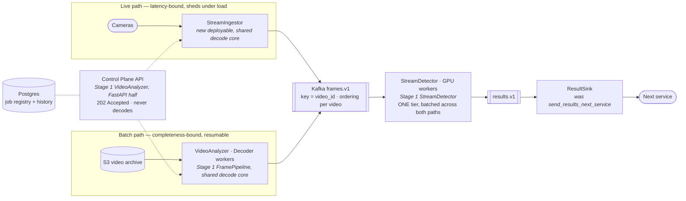
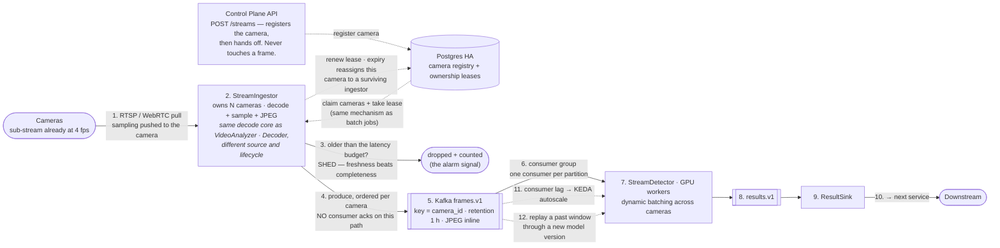
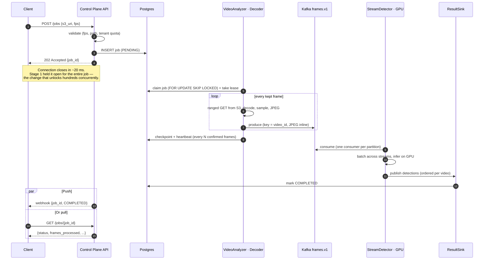
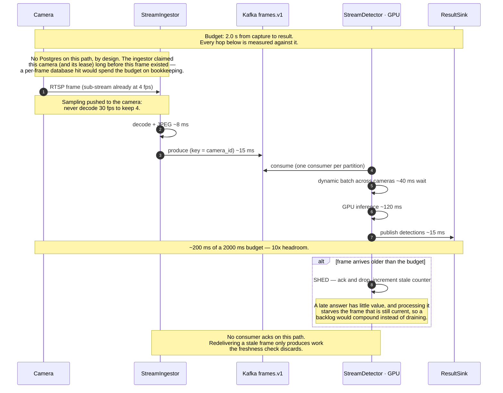

# Distributed Video Processing Pipeline — Design (Stage 2: Production Scaling)

Answers the two follow-up questions from the brief:

1. **How would you restructure the architecture differently to analyze hundreds of videos concurrently?**
2. **What changes would you make to ensure high availability and fault tolerance?**

Stage 1 is the working system this builds on; its design lives in
[`design/stage 1/`](../../stage%201/).

---

## 0. The reframing that drives everything

Stage 2 is not "Stage 1 with more replicas." During the Stage 1 Q&A the
interviewer described the production reality: **live cameras with a ~2 second
latency budget** (§16 Q5). That is a different *shape* of workload, not merely a
larger one.

| | Stage 1 — a file | Production — a camera |
|---|---|---|
| Input | Bounded. It has an end. | Unbounded. It never ends. |
| Success | Every frame processed | Every frame processed **in time** |
| Under load | Slow down — backpressure works | **You cannot slow a camera down.** Someone drops frames; the only question is whether you chose which |
| Job model | Starts, completes, reports | A *subscription* that runs for months |
| Acks | Earn their keep | Largely pointless (§16 Q6) |

So the target system runs **two workloads over one inference tier**:

- **Live path** — latency-bound. Sheds under load, no consumer acks, freshness beats completeness.
- **Batch path** — completeness-bound. Every frame of the archive matters; acks, checkpoints and resume all apply. This is Stage 1's semantics, scaled.

Designing only for "more files" would answer a question the interviewer had
already moved past. Designing only for cameras would abandon the archive tool
that prompted the project. The architecture below serves both, and is explicit
about where their guarantees diverge.

---

## 1. Where Stage 1 actually breaks

Not a list of things that could be nicer — the specific walls, in the order they
are hit.

| # | Bottleneck | Why it fails at scale | Fix |
|---|---|---|---|
| 1 | **`/analyze` blocks until the job finishes** | One HTTP connection held for the entire job. At hundreds concurrent: connection exhaustion, gateway timeouts, and a client retry doubles the work | Async submission: **202 + job_id**, poll or webhook (§2.1) |
| 2 | **Decoding runs inside the API process** | Decode is CPU-bound; the API is I/O-bound. Coupled, you scale the wrong resource and one heavy video degrades every request | Separate **decoder worker tier** (§2.3) |
| 3 | **Partition count caps concurrent videos** | 4 partitions with one active consumer each = 4 ordered videos at a time. Video 5 waits | **Kafka**, partitions in the hundreds (§2.4) |
| 4 | **One video = one worker** | A 2-hour archive file takes as long as it takes. No amount of hardware helps | **Segment-parallel decode** (§2.6) |
| 5 | **Redis holds every frame in RAM** | 300 streams x 4 fps x 80 KB ≈ **96 MB/s** of RAM churn. Redis is the most expensive place to put bytes that live for two seconds | **Inline frames in Kafka**, drop the blob store (§2.5) |
| 6 | **Job state has no durable history** | Redis answers "is it done"; it cannot answer "which videos failed last week" | **Postgres** as system of record (§2.2) |
| 7 | **Stale-job heuristic is a 120 s guess** | Resume waits two minutes because a `RUNNING` record is ambiguous | **Leases with heartbeats** (§3.4) |

---

## 2. Question 1 — hundreds of videos concurrently

### 2.1 Async submission: the single most important change

`POST /jobs` validates, writes the job to Postgres, and returns **202 Accepted**
with a `job_id` — in about 20 ms. The client polls `GET /jobs/{id}` or receives a
webhook.

This one change removes the hard ceiling. Stage 1's synchronous 200 was the right
reading of the brief ("return 200 only after dispatching"), and we documented it
as an inherent limitation. In production it is the first thing that has to go:
holding a connection open for the duration of a job means concurrency is capped
by connection count and by whatever timeout sits in front of you.

**The guarantee does not weaken, it moves.** Stage 1 proved durability by making
the caller wait for publisher confirms. Here the job row is committed to Postgres
*before* the 202 — so an accepted job is durable, and a crash anywhere downstream
resumes it rather than losing it. The client learns the outcome asynchronously.

### 2.2 Postgres as system of record *and* work queue

One component doing two things it is genuinely good at:

- **System of record** — the job/stream registry, full history, per-tenant
  accounting, and the analytics Redis cannot serve ("which cameras degraded last
  night", "which videos failed last week"). This is the `PostgresJobRepository`
  that Stage 1's `JobRepository` port was written to accommodate (Stage 1 §5.4).
- **Work queue** — `SELECT … FOR UPDATE SKIP LOCKED` gives competing consumers
  with exactly-once claim semantics, transactionally with the state update. For
  job dispatch (hundreds per minute, not millions per second) this is ample, and
  it avoids running a second broker for a low-volume queue.

Deliberately *not* Kafka for job dispatch: consumer groups assign **partitions**,
not individual messages, so one slow job would head-of-line-block every other job
in its partition. Job dispatch wants competing consumers; the frame stream wants
ordering. Different tools.

### 2.3 Three tiers, scaled independently

```
control plane (I/O-bound)  →  producers (CPU-bound)  →  inference (GPU-bound)
```

The split is placed where the *resource* changes, which is what makes independent
scaling meaningful:

- **Control plane** — stateless FastAPI behind a load balancer. Scales on request
  rate. Cheap.
- **Stream ingestors** (live) — each owns N cameras: pull RTSP, decode, sample,
  publish. Scales with camera count.
- **Decoder workers** (batch) — claim a job, stream from S3, decode, sample,
  publish, checkpoint. Scales on queue depth.
- **Inference tier** — GPU. Consumes frames, batches across streams, publishes
  detections. Scales on consumer lag.

**Why not co-locate decode and inference?** It would remove a network hop and cut
latency. But decode is CPU and inference is GPU, and the GPU is the expensive
resource — co-locating means GPUs idle during decode, and you cannot add CPU
without buying more GPU. Keeping them apart also lets the GPU **batch across many
streams**, which is where most inference throughput comes from. The hop costs
~15 ms against a 2000 ms budget; the utilisation is worth far more than that.

### 2.4 Kafka for the frame stream

`frames.v1`, **key = `video_id`** (or `camera_id`), ~256 partitions, RF=3.

| Property | Why it matters here |
|---|---|
| **Ordering per key is native** | Exactly the guarantee the interviewer required (§16 Q4), without our single-active-consumer workaround |
| **Partitions scale to hundreds** | Concurrent ordered videos is now a config number, not an architectural limit |
| **Retention and replay** | The one Kafka gives that a queue never can — see below |
| **Consumer lag is a first-class metric** | Becomes the autoscaling signal (§2.7) |
| **Throughput** | Sequential disk writes and zero-copy reads; 96 MB/s is unremarkable for Kafka |

**Replay is the feature that justifies the migration.** A queue deletes a message
once consumed. A log keeps it. That means you can re-run *last Tuesday's frames*
through a new model version to compare detections — which for a face recognition
product is not a nice-to-have, it is how you validate a model before shipping it.
It also turns "we had a bug in the detector for six hours" from data loss into a
replay.

Partition count is set well above expected concurrency (256 for a few hundred
streams), because raising it later re-keys existing data and breaks ordering
during the transition. Partitions are cheap; a re-partition is not.

### 2.5 Frames travel *inside* the Kafka message — reversing Stage 1

Stage 1 used a claim-check: JPEG into Redis, a ~200 byte reference onto the
queue. **Stage 2 inlines the JPEG and deletes the blob store from the hot path.**

This is a deliberate reversal, and the reasoning is that the constraint changed:

> The claim-check existed because **RabbitMQ holds messages in memory**, so
> 80 KB x thousands is ruinous. **Kafka is an append-only log on disk** with
> zero-copy reads — large-ish messages are precisely what it is built for.
> Changing the broker removes the reason the pattern existed.

What it buys:

- **One fewer system in the hot path**, one fewer failure mode, one fewer hop in
  the latency budget.
- **Replay actually works.** With references, replaying last Tuesday finds
  expired blobs and nothing else. With inline frames the pixels are still in the
  log. The replay story in §2.4 is only real because of this decision.
- **No orphan blobs**, no TTL tuning, no "blob expired before the consumer got
  there" dead-letter class (Stage 1 §5.3 loses a whole failure mode).

What it costs: retention is now sized in bytes. At 96 MB/s, one hour of retention
is ~350 GB before replication. Tuned per topic — live frames 1 h (they are
worthless after 2 s anyway), batch frames 24 h. Cold archival, if wanted, is an
S3 sink connector rather than a hot-path dependency.

**And Redis goes away completely.** Once frames live in Kafka, nothing is left
that needs it:

| Redis did this in Stage 1 | Who does it in Stage 2 |
|---|---|
| Frame blobs | Kafka, inline (above) |
| Dedup guard | Nobody. Detections are keyed `(video_id, frame_id)`, so a redelivery *overwrites* rather than duplicates (§3.5). A guard would only save redundant GPU work — and the live path has no acks, so nothing is ever redelivered there |
| Job / stream state | Postgres, which is also the system of record |
| Rate limiting | The API gateway, where it belongs |

So Stage 2 runs **two** stateful systems (Kafka, Postgres) where Stage 1 ran
three. That is not a coincidence — it follows directly from the broker change.
Redis existed to work around RabbitMQ; removing RabbitMQ removes Redis with it.

### 2.6 Segment-parallel decode, and its honest cost

A 2-hour archive video on one worker takes as long as it takes. Splitting it into
N time ranges, seeking to each start and decoding in parallel, turns single-video
latency from `O(length)` into `O(length / N)`.

**But this conflicts with per-video ordering.** Segments decoded in parallel reach
the same partition out of order. The two cannot both be free, so it is a
per-workload choice rather than a default:

| Workload | Choice |
|---|---|
| **Live stream** | Inherently sequential. No conflict, no decision to make. |
| **Batch, order required** | One worker per video, segments sequential. Latency is the length of the video's decode. |
| **Batch, throughput required** | Parallel segments plus a downstream **reorder buffer** keyed on `frame_id`, which trades memory and a bounded delay for parallelism. |

Stating this plainly matters more than a diagram implying both are free.

### 2.7 Push sampling upstream — the biggest win nobody draws

For a live 30 fps camera sampled at 4 fps, Stage 1's approach decodes **all 30**
frames and discards 26. At 300 cameras that is 9,000 frames/s of decode to
produce 1,200 useful ones — the single largest waste in the system.

Almost every IP camera exposes a configurable **sub-stream**. Requesting 4 fps at
the source removes ~87% of decode work before it exists. Where the camera cannot,
decoding only keyframes or using hardware decode (NVDEC) recovers much of it.

This is what the interviewer meant by *"in our production we do it smarter"*
(§16 Q1). `FrameSampler` remains the fallback for sources that cannot be asked —
and it is still what the batch path uses, unchanged.

### 2.8 Illustrative capacity model

Numbers to make the shape concrete, not a sizing commitment.

| Quantity | Value |
|---|---|
| Cameras | 300 @ 4 fps sampled | 
| Frame rate into the bus | 1,200 frames/s |
| Frame size (720p JPEG q85) | ~80 KB |
| Bus throughput | **~96 MB/s** (~288 MB/s with RF=3) |
| Kafka | 3–5 brokers on NVMe; comfortable |
| Kafka retention (live, 1 h) | ~350 GB pre-replication |
| GPU inference | ~200–400 fps per modern GPU batched → **4–6 GPUs** |
| Decode (with camera-side sampling) | 1,200 fps → tens of CPU cores, or 1–2 GPUs with NVDEC |
| Decode (without it) | 9,000 fps → several times the above. See §2.7 |

The last two rows are the argument for §2.7 in one line.

---

## 3. Question 2 — high availability and fault tolerance

Availability is not one feature; it is a property that has to hold at every tier
and at every failure boundary. Taken tier by tier, then by failure mode.

### 3.1 Per-tier

| Tier | Availability design |
|---|---|
| **API** | Stateless, ≥3 replicas across ≥3 AZs behind an LB. Rolling deploys, readiness gates, PodDisruptionBudgets. Losing one is invisible. |
| **Postgres** | Primary + **synchronous** standby in another AZ, automated failover (Patroni / RDS Multi-AZ). Synchronous because an acknowledged job that vanishes is a broken promise. PITR for the history. |
| **Kafka** | RF=3, `min.insync.replicas=2`, `acks=all`, brokers spread across AZs. Survives one broker *and* one AZ. |
| **Ingestors / decoders** | Stateless; all progress is in Postgres or Kafka offsets. Kill any pod; work is reclaimed by lease expiry. |
| **Inference** | Stateless; consumer group rebalances on loss. Model artefacts from a versioned registry, never baked into ad-hoc images. |
| **Object storage (S3)** | Regionally replicated by the provider; the source of truth for archive video. A decoder that dies mid-file re-reads the range it needs. |

### 3.2 Failure scenarios

| Failure | What happens |
|---|---|
| API pod dies | LB removes it. In-flight requests retry; no job is lost because jobs are durable *before* the 202. |
| Decoder dies mid-video | Lease expires; another worker claims the job and resumes **from the checkpoint** — Stage 1's mechanism, unchanged. |
| Inference pod dies | Consumer group rebalances, offsets replayed from the last commit. At-least-once redelivery, absorbed by the dedup guard. |
| Kafka broker dies | ISR shrinks; producers continue against `min.insync.replicas=2`. |
| **Whole AZ dies** | Every tier has capacity in the other two; Postgres fails over. Degraded capacity, not an outage. |
| Postgres failover | Writes pause seconds; producers keep publishing to Kafka. Job *bookkeeping* stalls, frame *processing* does not — the tiers are decoupled for exactly this reason. |
| Downstream service down | `results.v1` backs up in Kafka and drains when it returns. The log is the buffer. |
| A camera goes offline | Ingestor reconnects with backoff; the stream is marked degraded, alarmed, and everything else is unaffected. |
| **An ingestor dies** | Its camera leases expire; surviving ingestors claim those cameras and reconnect. Frames captured in the gap are simply lost — correct for a live path, where they would be stale by the time anyone could replay them. |
| Poison frame | Bounded retries, then DLQ. The DLQ is capped and replayable. |
| **Load exceeds capacity** | See §3.3 — this is designed behaviour, not a failure. |

### 3.3 Graceful degradation: choosing what to drop

The most important fault-tolerance property in a live system is what it does when
it *cannot* keep up. Doing nothing means the backlog grows, latency grows with
it, and eventually every answer is stale — total failure by increments.

A defined degradation ladder instead:

1. **Autoscale** the inference tier on consumer lag (KEDA). Usually enough.
2. **Shed stale frames.** A frame older than the latency budget is dropped, acked
   and counted. Built and tested in Stage 1; here it becomes load-bearing. Losing
   one frame at 4 fps is 250 ms of coverage that the next frame supersedes.
3. **Reduce effective sample rate** on lower-priority streams — 4 fps to 2 fps
   halves the load and degrades resolution-in-time rather than dropping cameras.
4. **Prioritise by tenant/stream class.** Live security streams outrank archive
   backfill; separate topics or consumer groups keep backfill from starving live.
5. **Shed at the edge.** Refuse new *batch* job admissions (429) before live
   quality suffers. The archive can wait; a camera cannot.

Every rung is measurable and alarmable, so degradation is visible rather than
silent.

### 3.4 Leases replace the staleness heuristic

Stage 1 waits `STALE_RUNNING_JOB_SEC` (120 s) before resuming a `RUNNING` job,
because the record is ambiguous: crashed, or still working elsewhere? Without a
lock, the heartbeat gap is the only safe guard — and resuming a live job would
double-dispatch every remaining frame.

Production replaces the guess with a **lease**: the worker holds `lease_until`
in the job row and renews it on a heartbeat. Expiry is now *evidence*, not
inference, so recovery takes seconds instead of two minutes and can never race a
live worker.

### 3.5 Correctness under at-least-once

Kafka, like RabbitMQ, is at-least-once. The interviewer confirmed duplicates are
acceptable (§16 Q6), so the aim is *cheap* idempotency rather than exactly-once:

- Detections keyed `(video_id, frame_id)` — a replay overwrites rather than
  duplicates.
- Offsets committed **after** results are published, never before. Same
  discipline as Stage 1's ack-after-flush, one layer up.
- Downstream is expected to be idempotent on that key. Documented as a contract.

And per §16 Q6, the **live path does not ack at all** — redelivering a stale
frame only creates work the freshness check discards.

### 3.6 What we would measure

Availability you cannot see is a guess.

- **SLIs**: end-to-end frame latency p50/p95/p99 against the 2 s budget; frames
  shed per minute; consumer lag per partition; job success rate; time-to-first-frame.
- **Traces**: OpenTelemetry, propagated from the ingestor through to the result
  sink, so one frame is followable across every hop.
- **The alarms that matter**: consumer lag trending up (capacity), shed rate
  above zero (over budget), DLQ non-empty (poison or expiry), lease expiries
  above baseline (workers crashing).
- **Drills**: regularly kill an AZ in staging. An untested failover is a theory.

---

## 4. Storage

| Data | Where | Why |
|---|---|---|
| Source videos | **S3** | Durable, cheap, effectively unbounded. Decoders stream ranged GETs rather than downloading whole files, so a worker never needs disk for a 4 GB video. Lifecycle rules tier to Glacier. |
| Frames in flight | **Kafka** (inline) | Ephemeral. Retention is the storage policy (§2.5). |
| Job / stream registry | **Postgres** | Transactional, queryable, durable. Also holds **camera ownership leases** for the live path, so a dead ingestor's cameras are reclaimed automatically (§5.3). |
| Detections | Downstream, plus `results.v1` | Kafka is the buffer; the system of record is the next service's. |
| Rate limits, quotas | **API gateway** | Not our stack. Redis is not reintroduced for it. |
| Models | Artefact registry (S3 + metadata) | Versioned, so replay can name the version it ran. |

`S3VideoSource` is an **additive** implementation of Stage 1's existing
`VideoSource` protocol — the port anticipated exactly this (§16 Q8).

---

## 5. Architecture diagrams

Sources: [`design/stage 2/flow diagram/`](../flow%20diagram/)

### 5.0 Which service is which

Stage 2 renames nothing arbitrarily. **`VideoAnalyzer` splits into two
deployables** because its two halves have different scaling profiles, and
`StreamDetector` becomes the GPU tier. Only the live ingestor is genuinely new.

| Stage 2 component | Comes from | Why it moved |
|---|---|---|
| **Control Plane API** | Stage 1 `VideoAnalyzer` (the FastAPI half) | I/O-bound; scales on request rate. Renamed because it serves both `/jobs` and `/streams`, and never decodes |
| **VideoAnalyzer · Decoder workers** | Stage 1 `VideoAnalyzer` (`FramePipeline`) | CPU-bound; scales on queue depth |
| **StreamIngestor** | *new deployable, shared decode core* | Live cameras have no job lifecycle — a subscription, not a job (§5.0.1) |
| **StreamDetector · GPU workers** | Stage 1 `StreamDetector` | GPU-bound; scales on consumer lag |
| **ResultSink** | Stage 1 `send_results_next_service` | The placeholder becomes a real deployable |

The split is placed where the **resource** changes, which is the whole point:
you cannot add decode capacity by buying GPUs, and you should not idle GPUs
while decoding.

### 5.0.1 Why StreamIngestor is separate from VideoAnalyzer · Decoder

The two do nearly the same work — decode, sample, JPEG, publish to Kafka — and
they **share one decode core** (the same `FrameSampler`, the same encode step).
They differ in exactly three ways, and each one is operational rather than
algorithmic:

| | VideoAnalyzer · Decoder | StreamIngestor |
|---|---|---|
| **Source** | S3, ranged GET | RTSP / WebRTC pull |
| **Lifecycle** | A bounded *job*: claim, checkpoint, complete | A *subscription*: assigned once, runs for months |
| **On failure** | Resume from the checkpoint — every frame matters | Shed and carry on — a stale frame is worthless |

Shipping them as two deployables from one codebase buys what matters:

- **Independent scaling triggers.** Decoders scale on job queue depth;
  ingestors scale on camera count. One number cannot serve both.
- **Blast radius.** A malformed archive file must never disturb live camera
  ingestion. Live security footage is not allowed to degrade because someone
  uploaded a corrupt MP4.
- **Different placement.** Decoders are interruptible and can run on cheap spot
  capacity; an ingestor holds a live TCP connection to a camera and cannot.

The shared half is real code reuse, not duplication: `VideoSource` is already
the Stage 1 port that abstracts "where frames come from", so `S3VideoSource`
and `RtspVideoSource` are two implementations of an interface that exists today.

**And note what the Control Plane API does *not* do: it never touches a frame.**
On the live path it accepts `POST /streams`, writes the camera to Postgres, and
hands off — nothing more. That is why it is no longer called "VideoAnalyzer":
in the live path it analyses nothing.

### 5.1 Overview — the whole system on one page

The claim this design rests on: **two workloads with different guarantees, over
one shared inference tier.** The live path optimises for freshness and sheds
under load; the batch path optimises for completeness and resumes after a crash.
They meet at Kafka and share the expensive GPU capacity from there on.



### 5.2 Batch path — files, in detail

Completeness-bound. Every frame of the archive matters, so the job is durable
before the 202, progress is checkpointed, and a crashed worker resumes rather
than restarts.

```mermaid
---
config:
  theme: mc
---
flowchart LR
    CL["Client"]
    API["2. Control Plane API<br/>stateless, 3 AZs — validate, register<br/>never decodes"]
    PG[("Postgres HA<br/>job registry + work queue<br/>primary + sync standby")]
    S3[("S3 video archive")]
    DEC["6. VideoAnalyzer · Decoder workers — CPU<br/>segment-parallel, checkpointed"]
    K[["9. Kafka frames.v1<br/>key = video_id · RF=3 · JPEG inline"]]
    GPU["11. StreamDetector · GPU workers<br/>batched across streams"]
    KR[["12. results.v1"]]
    SINK["14. ResultSink"]
    DLQ[["frames.dlq — bounded, replayable"]]

    CL -->|"1. POST /jobs {s3_uri, fps}"| API
    API -->|"3. INSERT job (PENDING)"| PG
    API -->|"4. 202 Accepted + job_id<br/>connection closes in ~20 ms"| CL

    PG -->|"5. claim + lease<br/>(FOR UPDATE SKIP LOCKED)"| DEC
    S3 -->|"7. ranged GET, streamed —<br/>never a whole file on disk"| DEC
    DEC -->|"8. produce, ordered per video"| K
    DEC -.->|"10. checkpoint + heartbeat<br/>(resume after a crash)"| PG

    K -->|"consumer group"| GPU
    GPU -->|"detections"| KR
    GPU -.->|"undecodable"| DLQ
    KR -->|"13. consume in order per video"| SINK
    SINK -->|"15. → next service"| OUT(["Downstream"])
    SINK -.->|"16. mark COMPLETED"| PG
    PG -.->|"17. webhook / GET /jobs/{id}"| CL
```



### 5.3 Live path — cameras, in detail

Latency-bound. Nothing here is resumable, because a redelivered frame would
arrive past the budget and be discarded anyway (§3.5). Note what is *absent*
compared with 5.2: no job registry, no checkpoints, no acks.

**Postgres is still here, but only off the frame path.** It holds the camera
registry and the **ownership leases**: the Control Plane API registers a camera,
ingestors *claim* cameras and renew a lease, and an expired lease reassigns that
camera to a surviving ingestor. That is deliberately the same mechanism the
batch path uses to claim jobs (§2.2) — one recovery story, not two.

Note what this buys: ownership lives in Postgres, **not in the API**. If the
control plane goes down, every camera keeps streaming; only *new* registrations
pause. Had the API pushed assignments to ingestors directly, it would have
become a single point of failure for live ingestion.



---

## 6. Sequence diagrams

Sources: [`design/stage 2/sequence diagram/`](../sequence%20diagram/)

### 6.1 Batch job — the async lifecycle

The sharpest contrast with Stage 1: the API no longer holds the connection.



### 6.2 Live stream — one frame against the 2 s budget



---

## 7. Migration — and what Stage 1 already got right

Each phase ships independently and is useful on its own. Nothing here is a
rewrite, which is the point: the Stage 1 abstractions were chosen so that the
production system could grow out of them.

| Phase | Change | What made it cheap |
|---|---|---|
| **1** | `202 Accepted` + Postgres job store + worker pool | `AnalysisService` already separates the *job decision* from the *frame movement* |
| **2** | Decoder tier split out of the API | `FramePipeline` is already a standalone component with no HTTP knowledge |
| **3** | RabbitMQ → Kafka | `FramePublisher` / `FrameConsumer` **ports** — a new adapter, no service changes |
| **4** | `S3VideoSource` | `VideoSource` **port** |
| **5** | GPU inference tier, dynamic batching | `detect_faces` already runs behind an executor boundary |
| **6** | Live ingest, camera-side sampling | `FrameSampler` unchanged; it becomes the fallback |
| **7** | Multi-region / DR | — |

What survives untouched:

- **`FrameSampler`** — the drift-free sampling maths is rate-agnostic and
  source-agnostic. It never changes.
- **The ports** — every one of them turned out to be the seam a migration phase
  needed. That is the return on Stage 1's "abstractions must have two real
  implementations" rule.
- **The ordering model** — Stage 1 partitions by `video_id` with one active
  consumer; Kafka does the same thing natively. The concept transfers; only the
  mechanism changes.
- **The freshness policy** — written in Stage 1 as a config flag defaulted off;
  in production it becomes load-bearing (§3.3).
- **Ack-after-flush discipline** — becomes commit-offsets-after-publish.

What gets replaced: the synchronous 200, the claim-check, **Redis entirely**,
the 120 s staleness heuristic, and RabbitMQ.

---

## 8. What this design deliberately does *not* do

Naming the non-goals is part of the design.

- **No exactly-once.** Confirmed unnecessary (§16 Q6). The cost — transactional
  writes spanning Kafka and the downstream service — buys nothing a dedup key
  does not.
- **No global frame ordering.** Only per-video. Cross-video ordering is
  meaningless and would serialise the whole system.
- **No microservice per verb.** Four deployables (API, ingestor, decoder,
  inference) because there are four distinct scaling profiles. Splitting further
  would add hops without adding elasticity.
- **No self-hosted Kafka if a managed one exists.** Operating Kafka well is a
  full-time job; MSK/Confluent is cheaper than the engineer.
- **No premature multi-region.** Multi-AZ first. Multi-region doubles cost and
  complexity and should wait for a stated RTO/RPO requirement.

---

## 9. Open questions for the team

Design decisions we would want answered before building, rather than assumed:

1. **Retention policy** — how far back must replay reach? That single number sets
   Kafka's storage cost and decides whether an S3 sink connector is needed.
2. **Multi-tenancy boundary** — shared topics with a tenant key, or topic per
   tenant? Isolation versus partition count.
3. **RTO / RPO** — decides multi-region, and whether Postgres replication is
   synchronous cross-region.
4. **Is 2 s the p99 or the average?** The difference materially changes GPU
   headroom and the shed threshold.
5. **Who owns the reorder buffer** if batch throughput is prioritised over
   ordering (§2.6) — us, or the downstream consumer?
6. **Camera sub-stream availability** — what fraction of the fleet can be asked
   for 4 fps directly? Directly sets the decode budget (§2.7).
